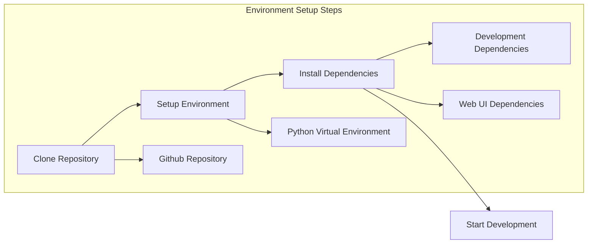
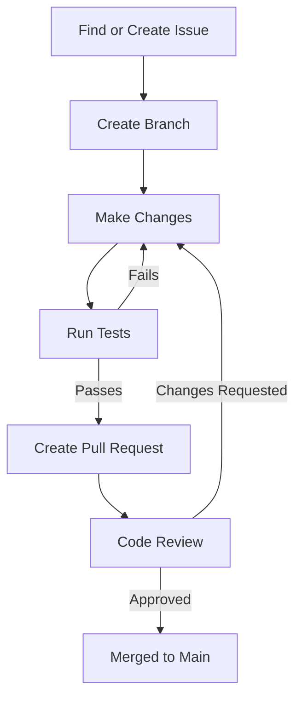
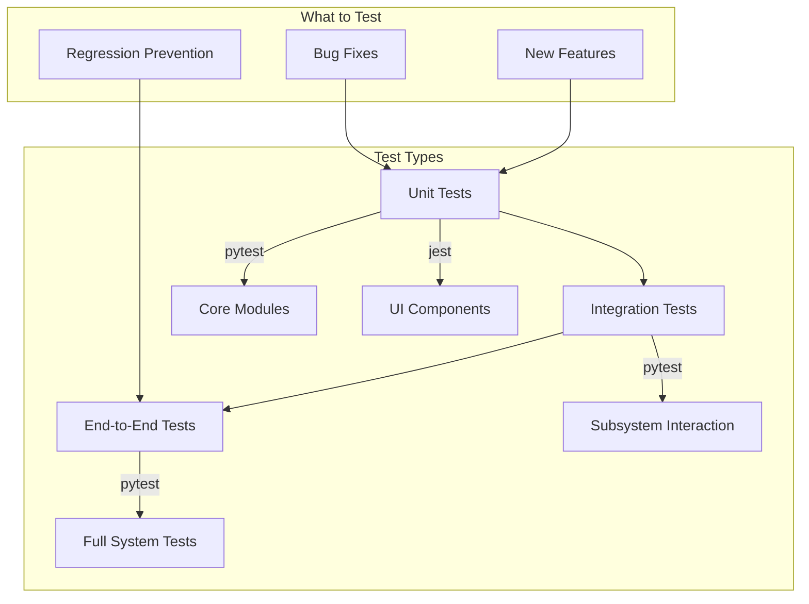

# Contributing to Locust

This guide provides information for developers who want to contribute to the Locust project. It covers the development environment setup, coding standards, testing, and contribution workflow.

## Development Environment Setup



1. **Clone the repository**:

   ```bash
   git clone https://github.com/locustio/locust.git
   cd locust
   ```

2. **Setup the environment using uv**:

   ```bash
   # Install uv if you don't already have it
   pip install uv
   
   # Create a virtual environment 
   uv venv
  
   # Activate the virtual environment
   # On Unix/macOS:
   source .venv/bin/activate
   # On Windows:
   .\.venv\Scripts\activate
   
   # Install the project with all dependency groups (build, test, lint)
   uv sync
   
   # If you only want specific dependency groups
   # uv sync --group build --group test
   ```

   Alternatively, you can use Hatch directly (also used in the project):ł

   ```bash
   # Install hatch if you don't have it
   pip install hatch
   
   # Create a virtual environment and run tests
   hatch run test:all
   ```

3. **Install Web UI dependencies** (if working on UI changes):

   ```bash
   cd locust/webui
   yarn install
   ```

   For more detailed information on Web UI development, including setup, testing, and best practices, see the [Developer Guide](developer_guide.md#web-ui-development).

## Contribution Workflow



1. **Find or create an issue**:
   - Check existing issues on the GitHub repository
   - Create a new issue if needed, clearly describing the bug or feature

2. **Create a branch**:

   ```bash
   git checkout -b feature/your-feature-name
   # or
   git checkout -b fix/bug-description
   ```

3. **Make your changes**:
   - Follow the coding standards (see below)
   - Implement your feature or fix
   - Add/update tests as appropriate

4. **Run tests**:

   ```bash
   pytest
   ```

5. **Create a pull request**:
   - Push your branch to GitHub
   - Create a pull request with a clear description
   - Link the relevant issue(s)

6. **Code review**:
   - Address any feedback from reviewers
   - Make requested changes and push updates

7. **Merge**:
   - Once approved, your PR will be merged into the main branch

## Coding Standards

Locust follows these coding standards:

1. **Code Formatting**:
   - Python code is formatted with Black
   - JavaScript/TypeScript code is formatted with Prettier

   ```bash
   # Format Python code
   black locust
   
   # Format web UI code
   cd locust/webui
    yarn format
   ```

2. **Type Checking**:
   - Python type hints are used where appropriate
   - TypeScript is used for the web UI

3. **Linting**:
   - Python code is checked with Ruff
   - TypeScript code is checked with ESLint

   ```bash
   # Lint Python code
   ruff locust
   
   # Lint web UI code
   cd locust/webui
    yarn lint
   ```

4. **Documentation**:
   - Public APIs should be well-documented
   - Complex algorithms should include explanatory comments
   - Changes should be reflected in the documentation

## Testing



1. **Unit Tests**:
   - Test individual functions and classes
   - Located in `locust/test/`
   - Run with `pytest`

2. **Integration Tests**:
   - Test interaction between components
   - Cover common use cases

3. **Web UI Tests**:
   - Test UI components
   - Located in `locust/webui/src/test/`
   - Run with `yarn test`

4. **Test Coverage**:
   - Aim for high test coverage for new features
   - Bug fixes should include tests that would have caught the bug
   - Run Python tests with `pytest`
   - Run Web UI tests with `yarn test` in the `locust/webui` directory
   - Run specific test files or test cases with `pytest path/to/test_file.py::TestClass::test_method`

## Web UI Development Workflow

When working on the Web UI:

1. **Run the development server**:

   ```bash
   cd locust/webui
   yarn dev
   ```

2. **Watch for changes while running Locust**:

   ```bash
   cd locust/webui
   yarn watch
   ```

3. **Build for production**:

   ```bash
   cd locust/webui
   yarn build
   ```

For more details on Web UI development, see the [Developer Guide](developer_guide.md#web-ui-development).

## Building and Running

1. **Running Locust from source**:

   ```bash
   python -m locust -f examples/basic.py
   ```

2. **Building the Web UI**:

   ```bash
   cd locust/webui
   yarn build
   ```

3. **Creating a distribution package**:

   ```bash
   pip install build
   python -m build
   ```

## Code Architecture Guidelines

When contributing to Locust, keep these architecture principles in mind:

1. **Modularity**: Keep components modular and with well-defined interfaces
2. **Extension Points**: Design for extensibility with event hooks and inheritance
3. **Backward Compatibility**: Maintain compatibility with existing code when possible
4. **Performance**: Remember Locust is a load testing tool; performance matters
5. **Documentation**: Document both code and user-facing features

## Project Structure Reference

This is a quick reference for the main directories and their purposes:

- **locust/**: Main source code
  - **user/**: User classes and task system
  - **rpc/**: RPC for distributed mode
  - **stats.py**: Statistics system
  - **web.py**: Web UI backend
  - **webui/**: Web UI frontend
  - **contrib/**: Protocol extensions
  - **test/**: Test suite
- **examples/**: Example scripts
- **docs/**: Documentation
