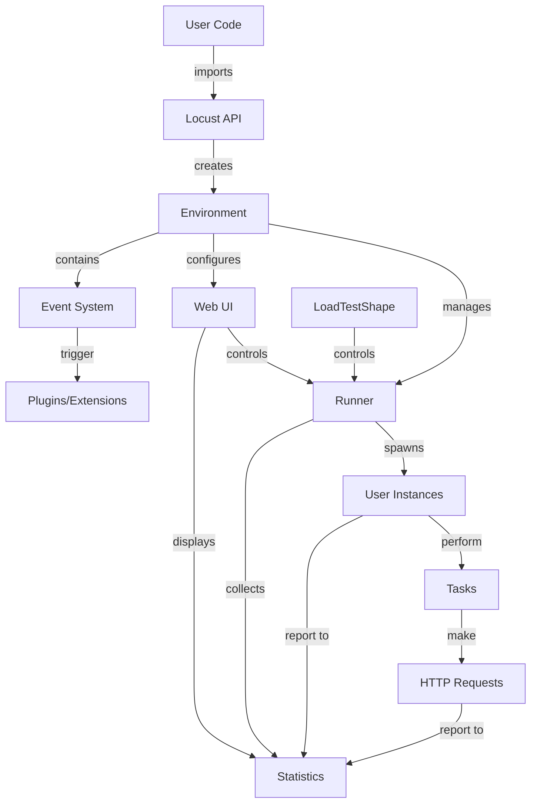

# Locust Core Components

This document details the core components of Locust and how they interact with each other.

## Core Components Interaction



## Component Details

### Environment (`env.py`)

The Environment is the central component that ties everything together. It:

- Holds references to the runner, stats, and other components
- Manages the event hooks
- Provides configuration

```python
# Example of Environment in action
environment = Environment(user_classes=[MyUser], events=events, host="https://example.com")
```

### Runner (`runners.py`)

Runners manage the spawning and stopping of users:

- **LocalRunner**: Runs the test on a single process
- **MasterRunner**: Coordinates the test across multiple worker nodes
- **WorkerRunner**: Executes tasks as directed by the master

```python
# Creating a local runner
runner = LocalRunner(environment)
runner.start(10, spawn_rate=2)  # Start 10 users, spawning 2 per second
```

### User Classes (`user/*.py`)

User classes define the behavior of virtual users:

- **User**: Base class for all user types
- **HttpUser**: For HTTP-based testing with Python Requests library
- **FastHttpUser**: A faster HTTP alternative (from `locust.contrib.fasthttp`) that uses geventhttpclient under the hood. Provides 5-6x better performance compared to HttpUser but with slightly different API in some edge cases.

```python
class WebsiteUser(HttpUser):
    wait_time = between(5, 15)
    # Optional: Share connection pool across all instances of this user class
    # for better performance with high concurrency
    pool_manager = PoolManager(maxsize=10, block=True)
    
    @task
    def index_page(self):
        self.client.get("/")
```

### Tasks (`task.py`)

Tasks represent the actions that users perform during the test:

- Can be weighted to control frequency
- Can be organized into TaskSets for grouped behavior
- Support sequential execution via SequentialTaskSet

### Statistics (`stats.py`)

The statistics system tracks all request metrics:

- Response times
- Request counts
- Failure rates
- Custom metrics

### Event System (`event.py`)

Locust has a powerful event system that allows for extending functionality:

- Events are fired at different points during test execution
- Listeners can be attached to events to execute custom code

```python
@events.request.add_listener
def my_request_handler(request_type, name, response_time, response_length, exception, **kwargs):
    print(f"Request to {name} took {response_time}ms")
```

### Web UI (`web.py` and `webui/`)

The web interface provides:

- Real-time statistics visualization
- Test control (start, stop, change user count)
- Test configuration
- Results export

### LoadTestShape (`shape.py`)

The LoadTestShape class allows for custom load patterns:

- Define custom patterns for number of users over time
- Override the `tick()` method to return (user_count, spawn_rate) tuples
- Create step load, waves, or any programmatic load pattern
- Each tick typically represents one second of test execution

```python
class StagesShape(LoadTestShape):
    stages = [
        {"duration": 60, "users": 10, "spawn_rate": 1},
        {"duration": 100, "users": 50, "spawn_rate": 5},
        {"duration": 180, "users": 100, "spawn_rate": 10},
        {"duration": 220, "users": 30, "spawn_rate": 10},
        {"duration": 230, "users": 0, "spawn_rate": 10},
    ]

    def tick(self):
        run_time = self.get_run_time()
        
        for stage in self.stages:
            if run_time < stage["duration"]:
                return stage["users"], stage["spawn_rate"]
        
        return None  # Test finished
```

### RPC System (`rpc/`)

The RPC system enables communication between master and worker nodes:

- Uses ZeroMQ for communication
- Transmits commands and statistics
- Enables distributed testing
