# Extending Locust with Custom Components

Locust's power comes from its extensibility. This guide details how to extend Locust with custom components.

## Extension Points Overview

Locust is designed to be extensible in several ways:

### 1. Custom User Classes

Create custom User classes by extending the base User class:

```python
from locust import User, task, between

class MyCustomUser(User):
    wait_time = between(1, 5)
    
    def __init__(self, *args, **kwargs):
        super().__init__(*args, **kwargs)
        self.custom_client = MyCustomClient()
    
    @task
    def my_task(self):
        self.custom_client.do_something()
```

### 2. Event Hooks

The event system allows you to hook into various points in the test lifecycle:

```python
from locust import events

@events.test_start.add_listener
def on_test_start(environment, **kwargs):
    print("A new test is starting")

@events.request.add_listener
def on_request(request_type, name, response_time, response_length, exception, **kwargs):
    if exception:
        print(f"Request to {name} failed with exception: {exception}")
```

### 3. Custom Load Shapes

Create custom load shapes by extending the LoadTestShape class:

```python
from locust import LoadTestShape

class StagesShape(LoadTestShape):
    stages = [
        {"duration": 60, "users": 10, "spawn_rate": 10},
        {"duration": 120, "users": 50, "spawn_rate": 10},
        {"duration": 180, "users": 100, "spawn_rate": 10},
        {"duration": 240, "users": 30, "spawn_rate": 10},
        {"duration": 300, "users": 0, "spawn_rate": 10},
    ]

    def tick(self):
        run_time = self.get_run_time()
        
        for stage in self.stages:
            if run_time < stage["duration"]:
                return stage["users"], stage["spawn_rate"]
        
        return None
```

### 4. Web UI Extensions

Extend the web UI by adding new endpoints:

```python
from locust import HttpUser, task, between, events
import flask
from flask import request

@events.init.add_listener
def on_locust_init(environment, **kwargs):
    if environment.web_ui:
        @environment.web_ui.app.route("/my-endpoint")
        def my_endpoint():
            return "Custom endpoint response"
```

### 5. Custom Clients

Create clients for testing non-HTTP systems by implementing a custom client:

```python
class RedisUser(User):
    def __init__(self, *args, **kwargs):
        super().__init__(*args, **kwargs)
        self.client = redis.Redis(host=self.host, port=6379)
    
    @task
    def get_key(self):
        start_time = time.time()
        try:
            result = self.client.get("my_key")
            events.request_success.fire(
                request_type="redis",
                name="get",
                response_time=(time.time() - start_time) * 1000,
                response_length=len(result) if result else 0,
            )
        except Exception as e:
            events.request_failure.fire(
                request_type="redis",
                name="get",
                response_time=(time.time() - start_time) * 1000,
                exception=e,
            )
```

## Extension Points Architecture Diagrams

### User-based Extensions

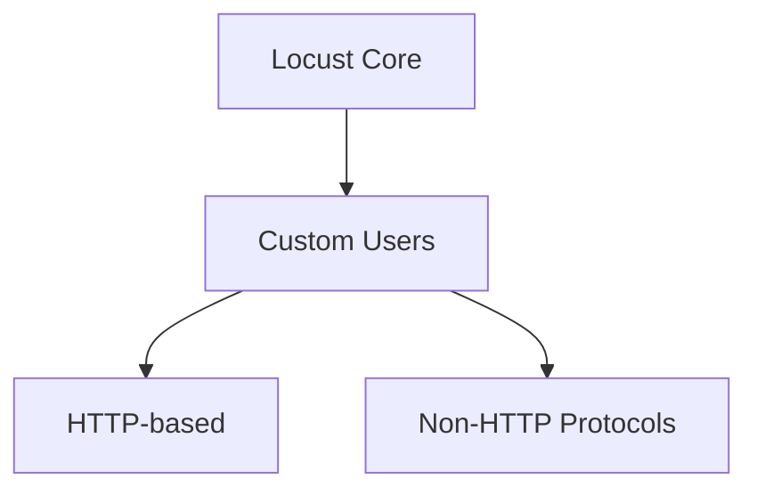

### Client-based Extensions

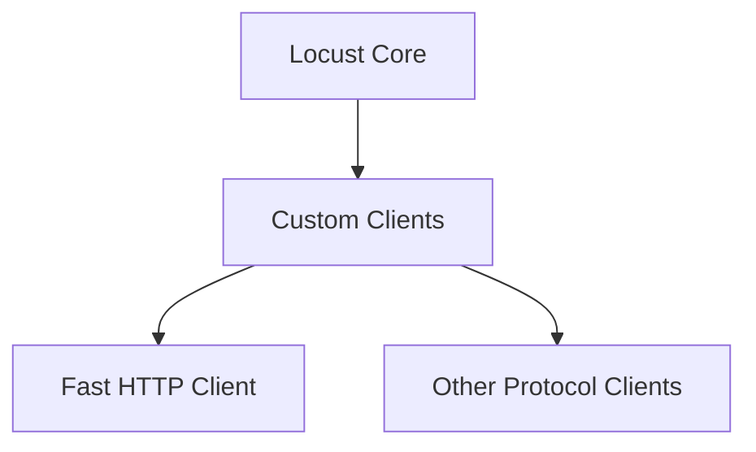

### Event-based Extensions

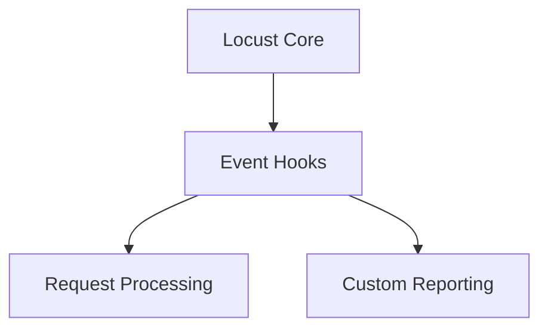

### Other Extension Types

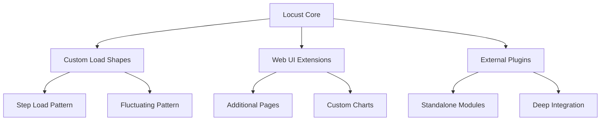

## Creating Custom User Classes

Custom user classes allow you to define user behavior for testing any system:

```python
from locust import User, task, constant
import some_client

class MyCustomUser(User):
    """Custom user for testing a non-HTTP system"""
    wait_time = constant(1)
    
    def __init__(self, *args, **kwargs):
        super().__init__(*args, **kwargs)
        self.client = some_client.Client(self.host)
    
    def on_start(self):
        """Called when a user starts"""
        self.client.login("username", "password")
    
    def on_stop(self):
        """Called when a user stops"""
        self.client.logout()
    
    @task
    def my_task(self):
        """Task that this user will execute"""
        start_time = time.time()
        try:
            result = self.client.do_something()
            # Report success to Locust's statistics
            self.environment.events.request_success.fire(
                request_type="custom",
                name="do_something",
                response_time=(time.time() - start_time) * 1000,
                response_length=len(result) if result else 0,
            )
        except Exception as e:
            # Report failure to Locust's statistics
            self.environment.events.request_failure.fire(
                request_type="custom",
                name="do_something",
                response_time=(time.time() - start_time) * 1000,
                exception=e,
            )
```

## Creating Custom HTTP Clients

### Extending FastHttpUser

The FastHttpUser class provides significantly better performance than the standard HttpUser. You can extend it for custom HTTP-based testing:

```python
from locust import FastHttpUser, task, between
from locust.contrib.fasthttp import FastHttpSession

class MyCustomFastHttpUser(FastHttpUser):
    wait_time = between(1, 3)
    
    def __init__(self, *args, **kwargs):
        super().__init__(*args, **kwargs)
        # Customize the client if needed
        self.client.max_redirects = 5
        self.client.connection_timeout = 60.0
        
    @task
    def my_task(self):
        # FastHttpUser has all the same methods as HttpUser
        with self.client.get("/endpoint", catch_response=True) as response:
            if response.status_code != 200:
                response.failure(f"Got status code {response.status_code}")
```

### Using Connection Pooling

For better performance, both HttpUser and FastHttpUser can use connection pooling to share connections between user instances:

```python
from locust import HttpUser, task, between
from urllib3 import PoolManager

class PooledHttpUser(HttpUser):
    wait_time = between(1, 3)
    # Create a shared pool manager for all instances of this User class
    pool_manager = PoolManager(maxsize=100, block=True)
    
    @task
    def my_task(self):
        self.client.get("/endpoint")
```

Connection pooling is especially beneficial in high-concurrency scenarios, as it reduces the overhead of establishing new connections for each request.

## Creating Custom Non-HTTP Clients

For testing non-HTTP systems, you'll need to create a custom client:

```python
class RedisClient:
    def __init__(self, host="localhost", port=6379):
        import redis
        self.redis = redis.Redis(host=host, port=port)
        self.environment = None  # Will be set by User instance
    
    def set(self, key, value):
        """Set a key in Redis and report to Locust"""
        start_time = time.time()
        request_meta = {
            "request_type": "redis",
            "name": "set",
            "start_time": start_time,
            "response_time": None,
            "exception": None,
            "context": {},
            "response_length": 0,
        }
        
        try:
            self.redis.set(key, value)
            request_meta["response_time"] = (time.time() - start_time) * 1000
            request_meta["response_length"] = len(value) if isinstance(value, (str, bytes)) else 0
        except Exception as e:
            request_meta["exception"] = e
        
        # Report to Locust
        if self.environment is not None:
            self.environment.events.request.fire(**request_meta)
            if request_meta["exception"]:
                self.environment.events.request_failure.fire(**request_meta)
            else:
                self.environment.events.request_success.fire(**request_meta)
                
        # Re-raise if exception occurred
        if request_meta["exception"]:
            raise request_meta["exception"]
```

## Working with Events

Locust's event system allows you to hook into different parts of the test lifecycle:

### Event Types

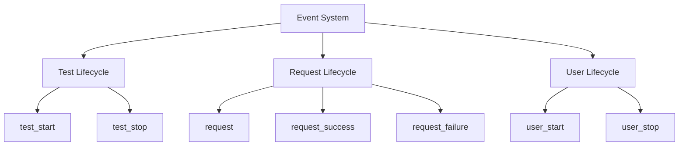

### Event Listeners Example

```python
from locust import events
import json
import time

# Store test start time
start_time = None

@events.test_start.add_listener
def on_test_start(environment, **kwargs):
    """Called when a test starts"""
    global start_time
    start_time = time.time()
    print(f"Test starting: {environment.host}")
    
    # Initialize external reporting system
    setup_external_reporting()

@events.request.add_listener
def on_request(request_type, name, response_time, response_length, exception, **kwargs):
    """Called when any request is completed (success or failure)"""
    # Send data to external system
    report_to_external_system({
        "type": request_type,
        "name": name,
        "response_time": response_time,
        "exception": str(exception) if exception else None
    })

@events.test_stop.add_listener
def on_test_stop(environment, **kwargs):
    """Called when a test stops"""
    execution_time = time.time() - start_time
    print(f"Test finished! Ran for {execution_time:.2f} seconds")
    
    # Finalize reporting
    finalize_external_reporting(environment.stats)
```

## Custom Load Shapes

Create custom load patterns by implementing a LoadTestShape subclass:

### Load Shape Workflow

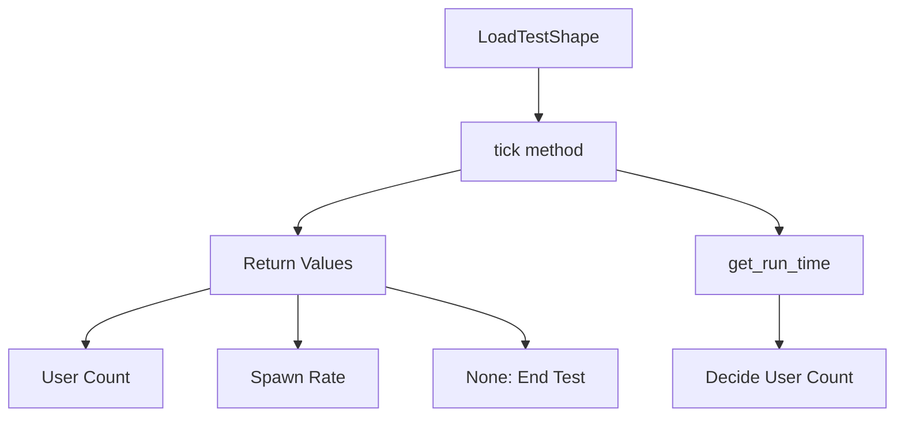

### Example Implementation

```python
from locust import LoadTestShape

class SinusoidalShape(LoadTestShape):
    """
    A load shape that follows a sinusoidal pattern
    """
    def __init__(self):
        self.min_users = 10
        self.max_users = 100
        self.time_limit = 600  # 10 minutes
        self.spawn_rate = 10
    
    def tick(self):
        """
        Returns a tuple of (user_count, spawn_rate) based on a sinusoidal pattern
        """
        run_time = self.get_run_time()
        if run_time > self.time_limit:
            return None  # End the test
        
        # Calculate where in the cycle we are (period of 2 minutes)
        cycle_time = run_time % 120
        # Adjust to range from 0 to 2*pi
        rads = (cycle_time / 120) * 2 * 3.14159
        
        # Calculate user count based on sine wave (0 to 1) scaled to our range
        user_count = int(((math.sin(rads) + 1) / 2) * (self.max_users - self.min_users) + self.min_users)
        
        return (user_count, self.spawn_rate)
```

## Extending the Web UI

Add custom pages or metrics to the Locust web interface:

### Web UI Extension Points

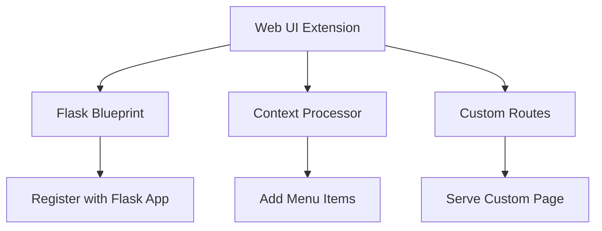

### Implementation Example

```python
from locust import HttpUser, task, between, events
from flask import Blueprint, request, Response

@events.init.add_listener
def on_locust_init(environment, **kwargs):
    """
    Called when Locust initializes
    """
    if environment.web_ui:
        # Create a blueprint for your custom page
        custom_page = Blueprint('custom_page', __name__)
        
        @custom_page.route('/my-custom-page')
        def my_custom_page():
            """Custom Web UI page"""
            # Get data from the environment
            stats = environment.runner.stats
            
            # Return HTML content
            return """
                <h1>My Custom Page</h1>
                <p>Total Request Count: {}</p>
                <p>Failed Requests: {}</p>
            """.format(stats.total.num_requests, stats.total.num_failures)
        
        # Register the blueprint with the Flask app
        environment.web_ui.app.register_blueprint(custom_page)
        
        # Add a menu item to the web UI
        @environment.web_ui.app.context_processor
        def add_custom_menu_item():
            return {
                'custom_menu_items': [
                    {'url': '/my-custom-page', 'label': 'My Custom Page'}
                ]
            }
```

## Creating Standalone Plugins

For more complex extensions, create a dedicated plugin package:

### Plugin Package Structure

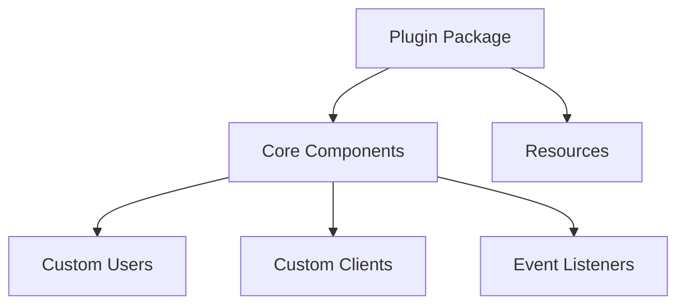

### Documentation Components

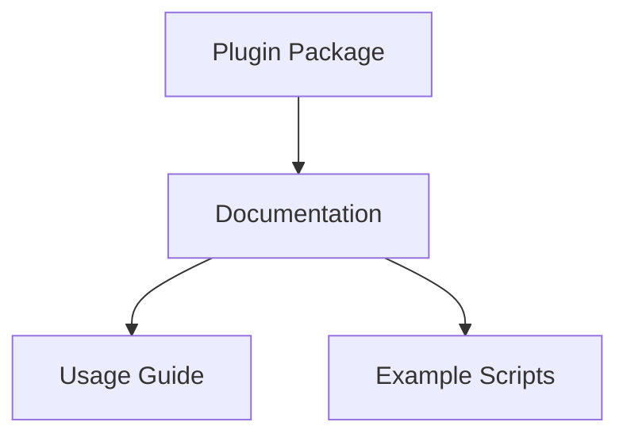

### Implementation Steps

1. **Create a package structure**:

   ```text
   my_locust_plugin/
   ├── __init__.py
   ├── users.py
   ├── client.py
   ├── listeners.py
   ├── ui_extensions.py
   └── examples/
       ├── basic.py
       └── advanced.py
   ```

2. **Make your plugin discoverable**:

   ```python
   # __init__.py
   from locust import events
   from .users import MyCustomUser
   from .client import MyCustomClient
   from .listeners import setup_reporting
   
   # This will be called when the plugin is imported
   @events.init_command_line_parser.add_listener
   def on_init_command_line_parser(parser, **kwargs):
       # Add custom command line options
       parser.add_argument(
           '--my-plugin-option',
           help="Custom option for my plugin",
           type=str,
           default="default"
       )
   
   # Export classes
   __all__ = ['MyCustomUser', 'MyCustomClient', 'setup_reporting']
   ```

3. **Install your plugin**:

   ```bash
   pip install -e .
   ```

4. **Use your plugin in a locustfile**:

   ```python
   from locust import HttpUser, task
   from my_locust_plugin import MyCustomUser, setup_reporting
   
   # Setup will be called automatically
   
   class MyUser(MyCustomUser):
       @task
       def my_task(self):
           self.client.do_something()
   ```

## Integrating with External Systems

Locust can be integrated with external monitoring and visualization systems:

### External Integration Flow

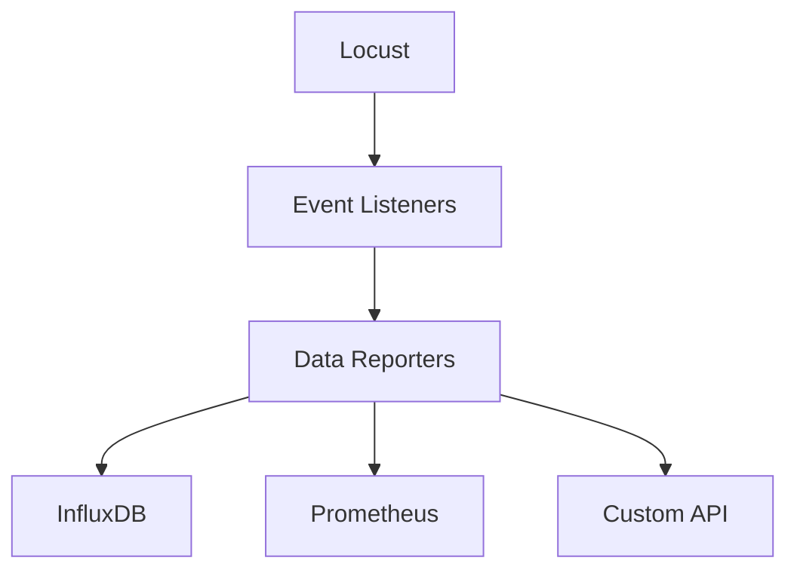

### Implementation Example

```python
from locust import events
import requests
import json
import threading
import time

# Configuration
grafana_url = "http://grafana:3000/api/live/push/locust"
influxdb_url = "http://influxdb:8086/write?db=locust"

# For periodic reporting
stats_thread = None
running = False

@events.test_start.add_listener
def on_test_start(environment, **kwargs):
    global running, stats_thread
    running = True
    
    # Start a background thread to periodically send stats
    stats_thread = threading.Thread(target=periodic_stats_reporter, args=(environment,))
    stats_thread.daemon = True
    stats_thread.start()

def periodic_stats_reporter(environment):
    while running:
        # Gather stats
        stats = environment.runner.stats
        
        # Format for InfluxDB
        current_time = int(time.time() * 1000000000)  # nanoseconds
        data = []
        for name, stat in stats.entries.items():
            data.append(f"request,name={name} "
                       f"count={stat.num_requests},"
                       f"failures={stat.num_failures},"
                       f"median={stat.get_response_time_percentile(0.5)},"
                       f"95percentile={stat.get_response_time_percentile(0.95)} "
                       f"{current_time}")
        
        # Send to InfluxDB
        try:
            requests.post(influxdb_url, data="\n".join(data))
        except Exception as e:
            print(f"Error sending to InfluxDB: {e}")
        
        # Wait for next reporting interval
        time.sleep(5)

@events.test_stop.add_listener
def on_test_stop(environment, **kwargs):
    global running
    running = False
    if stats_thread:
        stats_thread.join(timeout=2)
```

## Custom Weight Distributions

Control how tasks are selected with custom weight distributions:

### Task Selection Process

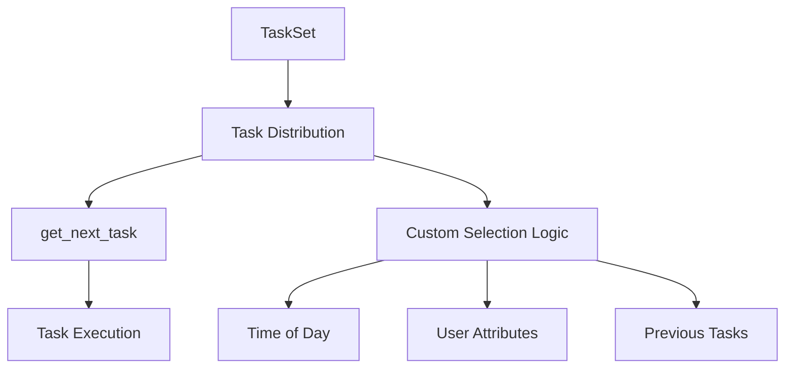

### Implementation Example

```python
import random
from locust import User, TaskSet, task

class CustomTaskSet(TaskSet):
    def __init__(self, *args, **kwargs):
        super().__init__(*args, **kwargs)
        self.task_distribution = self._create_distribution()
    
    def _create_distribution(self):
        """Create a custom distribution for task selection"""
        # This is a normal weighted random selection
        tasks = []
        for task_obj, weight in self.tasks:
            tasks.extend([task_obj] * weight)
        return tasks
    
    def get_next_task(self):
        """Override the default task selection method"""
        if not self.task_distribution:
            return None
        
        # Custom selection logic
        # Here we're implementing a simple time-of-day based weighting
        hour = datetime.datetime.now().hour
        if 9 <= hour <= 17:  # Business hours
            # Use daytime distribution (favor certain tasks)
            return random.choice(self.task_distribution[:len(self.task_distribution)//2])
        else:
            # Use nighttime distribution (favor other tasks)
            return random.choice(self.task_distribution[len(self.task_distribution)//2:])
```
