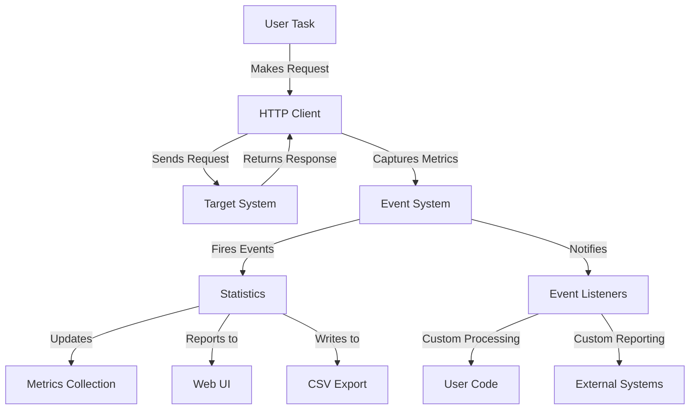
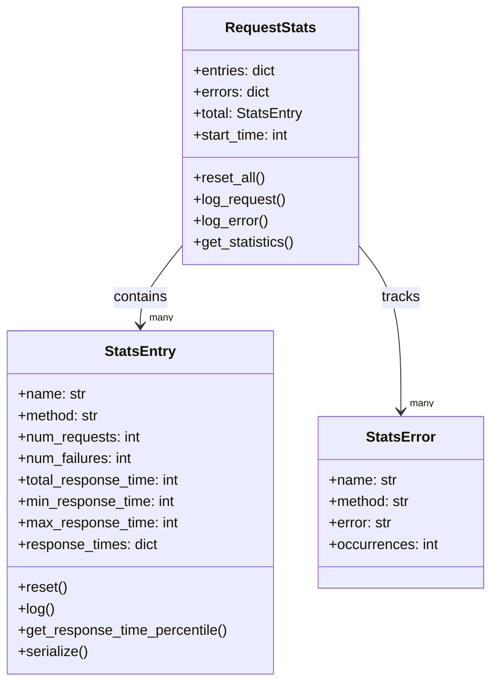
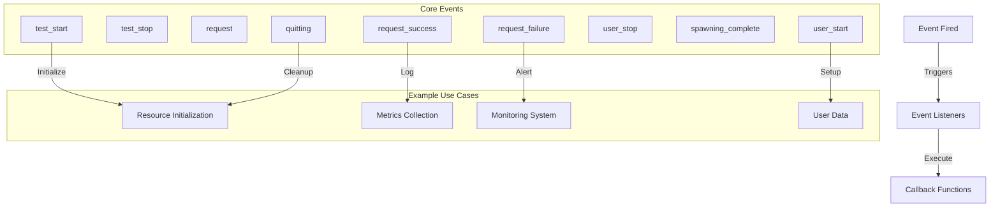
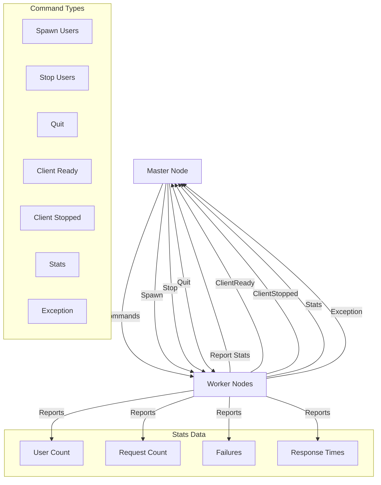
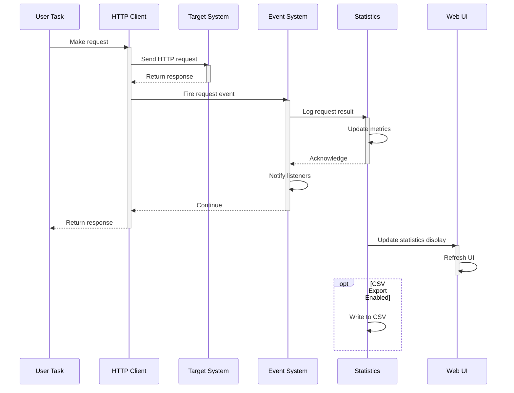
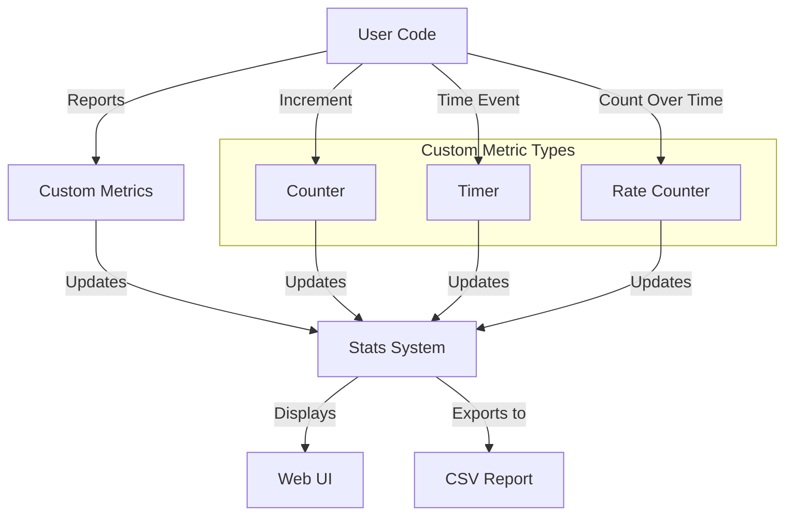
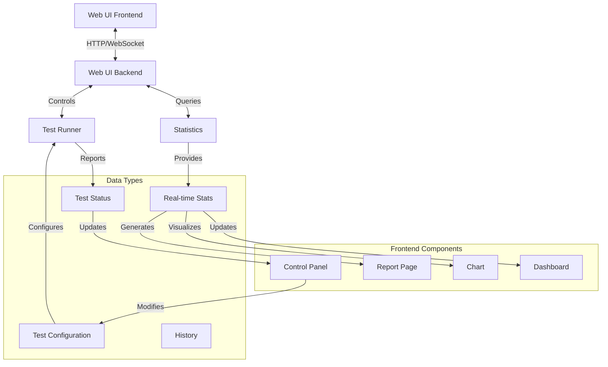

# Locust Data Flow

This document describes how data flows through the Locust system during test execution, focusing on request data, statistics, and events.

## Request and Response Flow

## Statistics Data Structure

## Event System Data Flow

The event system is a core part of Locust, enabling communication between components and allowing for extensions.

## Distributed Mode Data Flow

In distributed mode, Locust uses ZeroMQ for communication between master and worker nodes.

## Data Flow During Test Execution

## Custom Metrics Data Flow

In addition to standard HTTP metrics, Locust supports custom metrics:

## Web UI Data Flow

