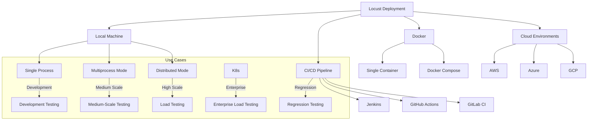
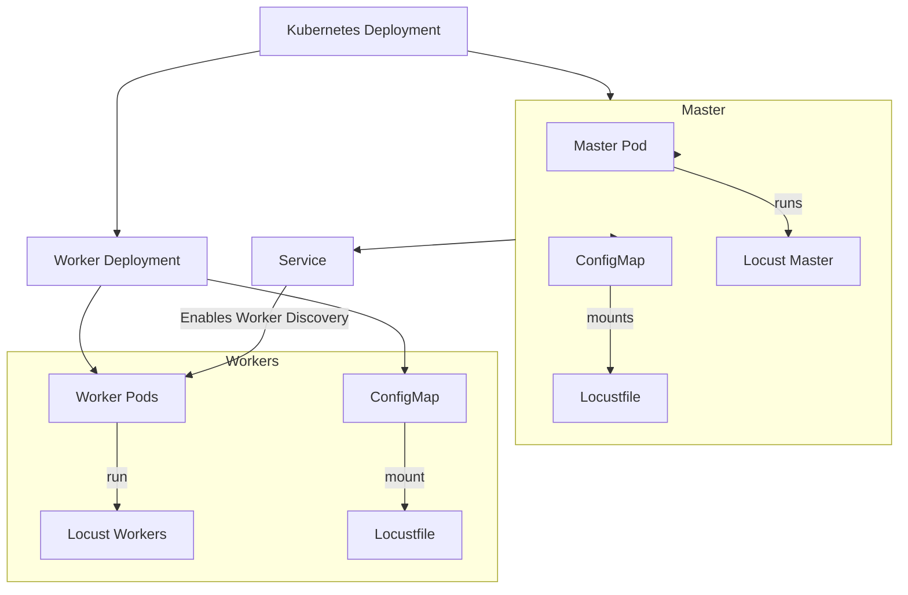
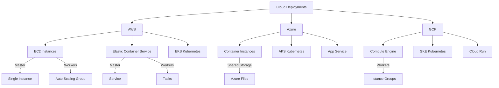
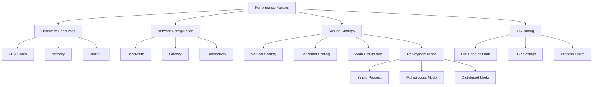
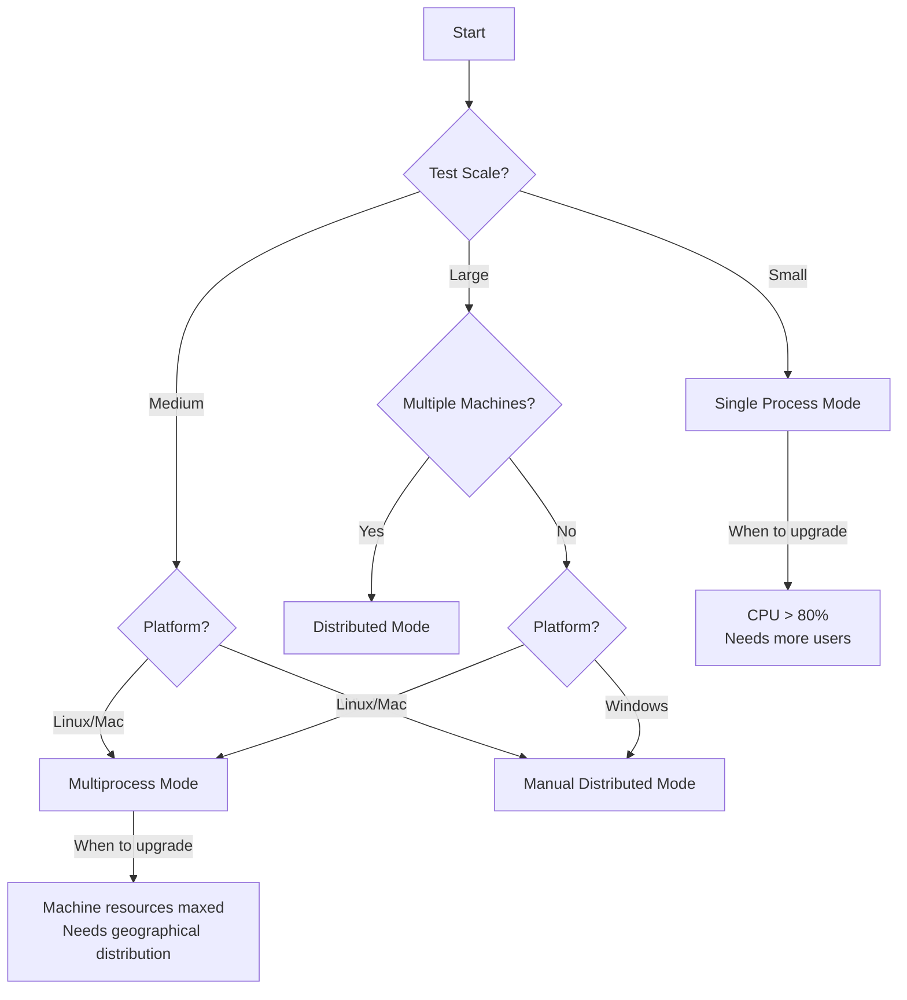

# Locust Deployment Guide

This guide covers the various ways to deploy and run Locust in different environments, from local development to cloud deployments.

## Deployment Options Overview



## Local Deployment

### Single Process Mode

Run Locust on a single machine for development or small-scale tests:

```bash
# Basic usage
locust -f locustfile.py

# Headless mode
locust -f locustfile.py --headless -u 100 -r 10 -t 5m
```

### Multiprocess Mode (Auto-Spawning)

Run Locust across multiple processes on a single machine with automatic process spawning:

```bash
# Specify the number of worker processes to spawn (plus one master process)
locust -f locustfile.py --processes 4

# Auto-detect the number of CPU cores and spawn one worker per core
locust -f locustfile.py --processes -1
```

This approach:
- Automatically launches one master process and the specified number of worker processes
- Simplifies deployment compared to manual distributed mode
- Uses `fork()` mechanism so it doesn't work on Windows
- Helps maximize resource utilization on a single machine
- Can be combined with `--worker` flag to only launch workers: `locust -f locustfile.py --worker --master-host=<host> --processes 4`

### Distributed Mode (Manual)

Run Locust across multiple machines for maximum scale:

```bash
# On the master machine
locust -f locustfile.py --master

# On worker machines
locust -f locustfile.py --worker --master-host=192.168.0.10
```

> **Note**: The key difference between multiprocess and distributed modes is that multiprocess automatically spawns processes on a single machine, while distributed mode requires manually starting separate processes (potentially on different machines). While this manual process sounds tedious, the deployment can be automated using tools like Ansible, Terraform, or custom deployment scripts to coordinate the launch of master and worker processes across your infrastructure.

## Docker Deployment

### Single Container

```bash
# Build the Docker image
docker build -t my-locust .

# Run Locust in single container mode
docker run -p 8089:8089 -v $PWD:/mnt/locust my-locust -f /mnt/locust/locustfile.py
```

### Docker Compose for Distributed Mode

Create a `docker-compose.yml` file:

```yaml
version: '3'

services:
  master:
    image: locustio/locust
    ports:
      - "8089:8089"
    volumes:
      - ./:/mnt/locust
    command: -f /mnt/locust/locustfile.py --master -H http://target-system

  worker:
    image: locustio/locust
    volumes:
      - ./:/mnt/locust
    command: -f /mnt/locust/locustfile.py --worker --master-host master -H http://target-system
    depends_on:
      - master
    deploy:
      replicas: 4
```

Run with:

```bash
docker-compose up --scale worker=10
```

## Kubernetes Deployment



### Kubernetes YAML Files

**Master Deployment**:

```yaml
apiVersion: apps/v1
kind: Deployment
metadata:
  name: locust-master
  labels:
    app: locust-master
spec:
  replicas: 1
  selector:
    matchLabels:
      app: locust-master
  template:
    metadata:
      labels:
        app: locust-master
    spec:
      containers:
      - name: locust-master
        image: locustio/locust
        ports:
        - containerPort: 8089
          name: web-ui
        - containerPort: 5557
          name: master-port
        command: ["locust"]
        args:
          - "--master"
          - "-f"
          - "/locust/locustfile.py"
          - "--host=http://target-system"
        volumeMounts:
          - name: locust-scripts
            mountPath: /locust
      volumes:
        - name: locust-scripts
          configMap:
            name: locust-scripts
---
apiVersion: v1
kind: Service
metadata:
  name: locust-master
spec:
  ports:
  - port: 8089
    targetPort: web-ui
    name: web-ui
  - port: 5557
    targetPort: master-port
    name: master-port
  selector:
    app: locust-master
  type: LoadBalancer
```

**Worker Deployment**:

```yaml
apiVersion: apps/v1
kind: Deployment
metadata:
  name: locust-worker
  labels:
    app: locust-worker
spec:
  replicas: 5
  selector:
    matchLabels:
      app: locust-worker
  template:
    metadata:
      labels:
        app: locust-worker
    spec:
      containers:
      - name: locust-worker
        image: locustio/locust
        command: ["locust"]
        args:
          - "--worker"
          - "--master-host=locust-master"
          - "-f"
          - "/locust/locustfile.py"
          - "--host=http://target-system"
        volumeMounts:
          - name: locust-scripts
            mountPath: /locust
      volumes:
        - name: locust-scripts
          configMap:
            name: locust-scripts
```

**ConfigMap for Locust Files**:

```yaml
apiVersion: v1
kind: ConfigMap
metadata:
  name: locust-scripts
data:
  locustfile.py: |
    from locust import HttpUser, task, between
    
    class QuickstartUser(HttpUser):
        wait_time = between(1, 5)
        
        @task
        def index_page(self):
            self.client.get("/")
```

### Deploy to Kubernetes

```bash
# Apply the configurations
kubectl apply -f locust-master.yaml
kubectl apply -f locust-worker.yaml
kubectl apply -f locust-scripts-configmap.yaml

# Scale workers as needed
kubectl scale deployment locust-worker --replicas=10

# Access the web UI
kubectl port-forward service/locust-master 8089:8089
```

## Cloud Provider Deployments



### AWS Deployment

Options for deploying Locust on AWS:

1. **EC2 Instances**:
   - Launch an EC2 instance for the master
   - Use an Auto Scaling Group for worker nodes
   - Configure a Security Group to allow communication

2. **ECS (Elastic Container Service)**:
   - Create a Task Definition for Locust
   - Run master as a Service
   - Run workers using ECS Tasks

3. **EKS (Elastic Kubernetes Service)**:
   - Use the Kubernetes configuration above
   - Deploy to an EKS cluster

### Azure Deployment

Options for deploying Locust on Azure:

1. **Azure Container Instances**:
   - Deploy a Container Group for master and workers
   - Use Azure Files to share locustfiles

2. **AKS (Azure Kubernetes Service)**:
   - Use the Kubernetes configuration above
   - Deploy to an AKS cluster

3. **Azure App Service**:
   - Deploy Locust as a Web App
   - Configure for master/worker mode

### GCP Deployment

Options for deploying Locust on GCP:

1. **Compute Engine**:
   - Create VMs for master and workers
   - Use Instance Groups for worker scaling

2. **GKE (Google Kubernetes Engine)**:
   - Use the Kubernetes configuration above
   - Deploy to a GKE cluster

3. **Cloud Run**:
   - Deploy Locust as a containerized service
   - Use Cloud Functions for additional processing

## CI/CD Integration

### GitHub Actions

Create a `.github/workflows/load-test.yml` file:

```yaml
name: Load Test

on:
  workflow_dispatch:
  schedule:
    - cron: '0 0 * * 1'  # Weekly on Mondays

jobs:
  load-test:
    runs-on: ubuntu-latest
    steps:
      - uses: actions/checkout@v2
      
      - name: Set up Python
        uses: actions/setup-python@v2
        with:
          python-version: '3.9'
          
      - name: Install dependencies
        run: |
          python -m pip install --upgrade pip
          pip install locust
          
      - name: Run Locust load test
        run: |
          locust -f locustfile.py --headless -u 100 -r 10 -t 5m --host=https://staging-api.example.com --csv=results
          
      - name: Upload results
        uses: actions/upload-artifact@v2
        with:
          name: load-test-results
          path: results*.csv
```

### Jenkins Pipeline

Create a `Jenkinsfile`:

```groovy
pipeline {
    agent any
    
    stages {
        stage('Checkout') {
            steps {
                checkout scm
            }
        }
        
        stage('Setup') {
            steps {
                sh 'pip install locust'
            }
        }
        
        stage('Run Load Test') {
            steps {
                sh 'locust -f locustfile.py --headless -u 100 -r 10 -t 5m --host=https://staging-api.example.com --csv=results'
            }
        }
        
        stage('Archive Results') {
            steps {
                archiveArtifacts artifacts: 'results*.csv', fingerprint: true
            }
        }
        
        stage('Parse Results') {
            steps {
                script {
                    // Parse CSV and determine if test passed thresholds
                    def success = sh(
                        script: 'python parse_results.py --threshold 500',
                        returnStatus: true
                    ) == 0
                    
                    if (!success) {
                        currentBuild.result = 'UNSTABLE'
                    }
                }
            }
        }
    }
    
    post {
        always {
            // Generate and publish HTML report
            sh 'python generate_report.py'
            publishHTML([
                allowMissing: false,
                alwaysLinkToLastBuild: true,
                keepAll: true,
                reportDir: '.',
                reportFiles: 'locust_report.html',
                reportName: 'Locust Load Test Report'
            ])
        }
    }
}
```

### GitLab CI

Create a `.gitlab-ci.yml` file:

```yaml
stages:
  - test
  - report

load_test:
  stage: test
  image: python:3.9
  before_script:
    - pip install locust
  script:
    - locust -f locustfile.py --headless -u 100 -r 10 -t 5m --host=https://staging-api.example.com --csv=results
  artifacts:
    paths:
      - results*.csv
    expire_in: 1 week

generate_report:
  stage: report
  image: python:3.9
  before_script:
    - pip install pandas matplotlib
  script:
    - python generate_report.py
  artifacts:
    paths:
      - locust_report.html
    expire_in: 1 month
  dependencies:
    - load_test
```

## Performance Considerations

When deploying Locust at scale, consider these performance factors:



### Hardware Sizing

- **Master Node**: 
  - CPU: 2+ cores
  - Memory: 4+ GB RAM
  - Network: 1+ Gbps
  
- **Worker Nodes**:
  - CPU: 4+ cores per worker
  - Memory: 8+ GB RAM per worker
  - Network: 1+ Gbps

### OS Tuning

Increase system limits for high-performance testing:

```bash
# Increase file handle limits (add to /etc/security/limits.conf)
*         hard    nofile      65536
*         soft    nofile      65536

# Adjust kernel parameters (add to /etc/sysctl.conf)
net.ipv4.tcp_max_syn_backlog = 40000
net.core.somaxconn = 40000
net.ipv4.ip_local_port_range = 10000 65000
```

### Worker Scaling Guidelines

- Start with a small number of workers and users
- Gradually increase worker count while monitoring resource usage
- When worker CPU usage exceeds 70%, add more workers
- Monitor master node resource usage - it can become a bottleneck at very large scales

### Deployment Mode Selection



Choose the appropriate deployment mode based on your needs:

1. **Single Process Mode**:
   - Best for: Development, debugging, small tests (up to a few hundred users)
   - Limitations: Limited to one CPU core, lower throughput

2. **Multiprocess Mode**:
   - Best for: Medium-scale tests on a single machine (utilizing all CPU cores)
   - Advantages: Automatic process management, simplified deployment
   - Limitations: Only works on Linux/Mac (uses fork()), limited to one machine
   - Command: `locust --processes -1` (auto-detects CPU cores)

3. **Distributed Mode**:
   - Best for: High-scale tests, geographical distribution, maximum throughput
   - Advantages: Can span multiple machines, highest possible load generation
   - Limitations: More complex setup, requires manual process management
   - Command: `locust --master` and `locust --worker --master-host=<host>`

## Monitoring and Observability

Integrate Locust with monitoring systems for better observability:

1. **Prometheus Integration**:
   - Use the Locust Exporter to expose metrics
   - Configure Prometheus to scrape these metrics
   - Create Grafana dashboards for visualization

2. **ELK Stack**:
   - Send Locust logs to Elasticsearch
   - Use Kibana to create dashboards
   - Set up alerts for performance issues

3. **Custom Dashboards**:
   - Use the Locust event hooks to send metrics to your monitoring system
   - Create custom dashboards for specific KPIs
   - Correlate load test data with target system metrics

## Security Considerations

When deploying Locust, especially in public clouds, consider these security aspects:

1. **Network Security**:
   - Use private networks for master-worker communication
   - Restrict access to the Locust web UI
   - Use TLS for all communications

2. **Authentication**:
   - Enable authentication for the web UI
   - Use API keys for programmatic access
   - Implement role-based access control

3. **Credential Management**:
   - Use environment variables or secure vaults for credentials
   - Never hardcode credentials in locustfiles
   - Rotate credentials regularly

4. **Target System Protection**:
   - Implement safeguards to prevent accidental overload
   - Use rate limiting and circuit breakers
   - Consider using staging environments for testing
