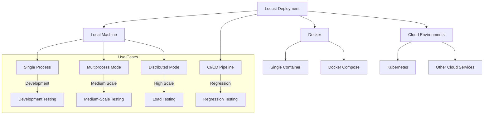
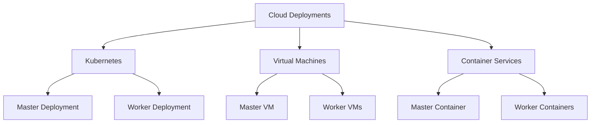
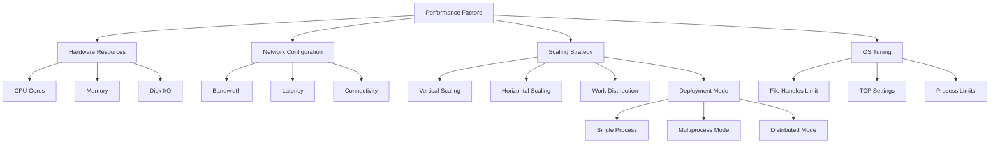
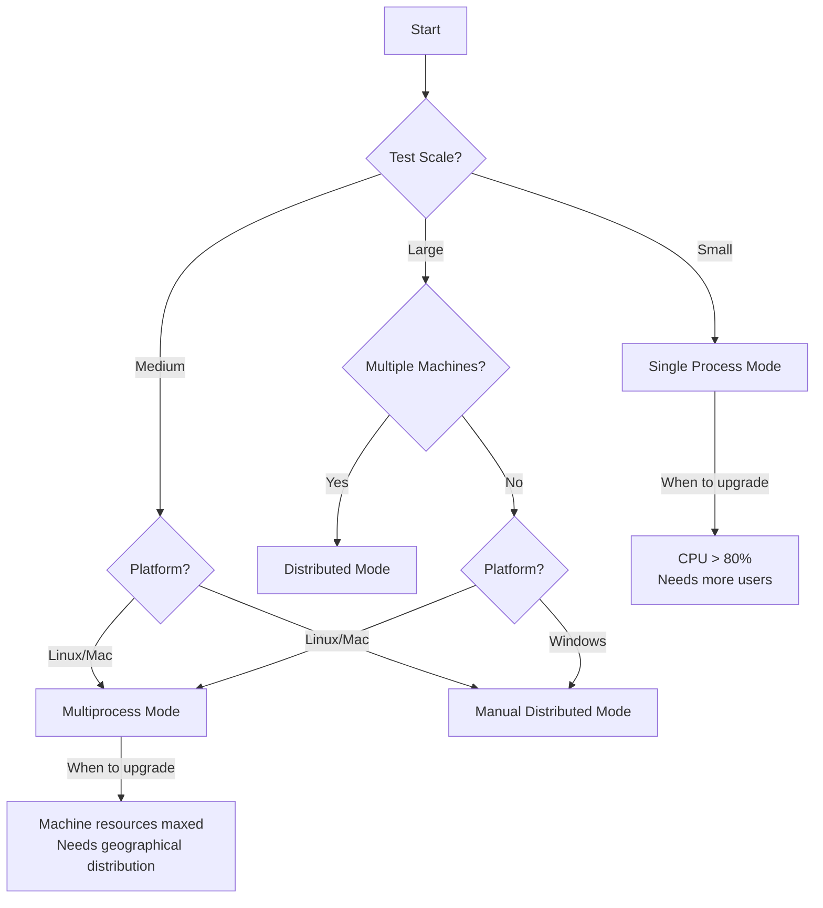

# Locust Deployment Guide

This guide covers the various ways to deploy and run Locust in different environments, from local development to cloud deployments.

## Deployment Options Overview



## Local Deployment

### Single Process Mode

Run Locust on a single machine for development or small-scale tests:

```bash
# Basic usage
locust -f locustfile.py

# Headless mode
locust -f locustfile.py --headless -u 100 -r 10 -t 5m
```

### Multiprocess Mode (Auto-Spawning)

Run Locust across multiple processes on a single machine with automatic process spawning:

```bash
# Specify the number of worker processes to spawn (plus one master process)
locust -f locustfile.py --processes 4

# Auto-detect the number of CPU cores and spawn one worker per core
locust -f locustfile.py --processes -1
```

This approach:
- Automatically launches one master process and the specified number of worker processes
- Simplifies deployment compared to manual distributed mode
- Uses `fork()` mechanism so it doesn't work on Windows
- Helps maximize resource utilization on a single machine
- Can be combined with `--worker` flag to only launch workers: `locust -f locustfile.py --worker --master-host=<host> --processes 4`

### Distributed Mode (Manual)

Run Locust across multiple machines for maximum scale:

```bash
# On the master machine
locust -f locustfile.py --master

# On worker machines
locust -f locustfile.py --worker --master-host=192.168.0.10
```

> **Note**: The key difference between multiprocess and distributed modes is that multiprocess automatically spawns processes on a single machine, while distributed mode requires manually starting separate processes (potentially on different machines). While this manual process sounds tedious, the deployment can be automated using tools like Ansible, Terraform, or custom deployment scripts to coordinate the launch of master and worker processes across your infrastructure.

## Docker Deployment

### Single Container

```bash
# Build the Docker image
docker build -t my-locust .

# Run Locust in single container mode
docker run -p 8089:8089 -v $PWD:/mnt/locust my-locust -f /mnt/locust/locustfile.py
```

### Docker Compose for Distributed Mode

Create a `docker-compose.yml` file:

```yaml
version: '3'

services:
  master:
    image: locustio/locust
    ports:
      - "8089:8089"
    volumes:
      - ./:/mnt/locust
    command: -f /mnt/locust/locustfile.py --master -H http://target-system

  worker:
    image: locustio/locust
    volumes:
      - ./:/mnt/locust
    command: -f /mnt/locust/locustfile.py --worker --master-host master -H http://target-system
    depends_on:
      - master
    deploy:
      replicas: 4
```

Run with:

```bash
docker-compose up --scale worker=10
```

## Kubernetes Deployment

Kubernetes is a popular platform for running Locust in distributed mode. The basic architecture consists of:

- A master deployment (single pod) that runs the Locust master
- A worker deployment (multiple pods) that runs Locust workers
- A service that exposes the Locust web UI
- A ConfigMap for storing the locustfile

For specific implementation details and examples, consider checking the [examples/kubernetes](https://github.com/locustio/locust/tree/master/examples/kubernetes) directory in the Locust repository or community-maintained deployments like [locust-swarm](https://github.com/SvenskaSpel/locust-swarm/).

## Cloud Deployments



### General Cloud Deployment Strategy

When deploying Locust to cloud environments, consider the following general strategies:

1. **Virtual Machines/Compute Instances**:
   - Deploy a single VM for the master node
   - Deploy multiple VMs for worker nodes
   - Configure network security to allow communication between nodes
   - Use automation tools like Terraform or Ansible for provisioning

2. **Container Services**:
   - Use container orchestration services to manage Locust containers
   - Deploy the master as a service with exposed ports
   - Deploy workers as scalable containers
   - Use shared storage or configuration for locustfiles

3. **Kubernetes**:
   - Use the Kubernetes configuration provided in the previous section
   - Can be deployed on any cloud provider's Kubernetes service

### Community Tools for Cloud Deployment

Several community-maintained tools can help with cloud deployments:

1. **[locust-swarm](https://github.com/SvenskaSpel/locust-swarm/)**: 
   - Helps deploy Locust to AWS environments
   - Provides automatic scaling of worker nodes

2. **Terraform modules**:
   - Check the examples directory for sample Terraform configurations
   - These can be adapted for different cloud providers

### Running Long Tests

For long-running load tests in cloud environments:

1. Configure proper error handling and recovery mechanisms
2. Use persistent storage for test results
3. Set up monitoring for both Locust and the target system
4. Implement automated shutdown to control costs

## CI/CD Integration

Locust can be integrated into CI/CD pipelines to run load tests as part of your development workflow. Common use cases include:

- Performance regression testing
- Load testing after significant changes
- Scheduled performance assessments
- Capacity planning tests

### CI/CD Best Practices

1. **Test Isolation**:
   - Use staging environments for load tests
   - Consider using test data/mocks to avoid affecting production data

2. **Performance Thresholds**:
   - Define success criteria for your load tests
   - Fail the CI pipeline if performance thresholds are exceeded

3. **Test Result Management**:
   - Archive test results as artifacts
   - Generate reports for historical comparison
   - Add trend analysis over time

4. **Test Scheduling**:
   - Run load tests at regular intervals
   - Trigger tests after significant changes
   - Consider running smaller tests more frequently and larger tests less often

## Performance Considerations

When deploying Locust at scale, consider these performance factors:



### Hardware Sizing

- **Master Node**: 
  - CPU: 2+ cores
  - Memory: 4+ GB RAM
  - Network: 1+ Gbps
  
- **Worker Nodes**:
  - CPU: 4+ cores per worker
  - Memory: 8+ GB RAM per worker
  - Network: 1+ Gbps

### OS Tuning

Increase system limits for high-performance testing:

```bash
# Increase file handle limits (add to /etc/security/limits.conf)
*         hard    nofile      65536
*         soft    nofile      65536

# Adjust kernel parameters (add to /etc/sysctl.conf)
net.ipv4.tcp_max_syn_backlog = 40000
net.core.somaxconn = 40000
net.ipv4.ip_local_port_range = 10000 65000
```

### Worker Scaling Guidelines

- Start with a small number of workers and users
- Gradually increase worker count while monitoring resource usage
- When worker CPU usage exceeds 70%, add more workers
- Monitor master node resource usage - it can become a bottleneck at very large scales

### Deployment Mode Selection



Choose the appropriate deployment mode based on your needs:

1. **Single Process Mode**:
   - Best for: Development, debugging, small tests (up to a few hundred users)
   - Limitations: Limited to one CPU core, lower throughput

2. **Multiprocess Mode**:
   - Best for: Medium-scale tests on a single machine (utilizing all CPU cores)
   - Advantages: Automatic process management, simplified deployment
   - Limitations: Only works on Linux/Mac (uses fork()), limited to one machine
   - Command: `locust --processes -1` (auto-detects CPU cores)

3. **Distributed Mode**:
   - Best for: High-scale tests, geographical distribution, maximum throughput
   - Advantages: Can span multiple machines, highest possible load generation
   - Limitations: More complex setup, requires manual process management
   - Command: `locust --master` and `locust --worker --master-host=<host>`

## Monitoring and Observability

Integrate Locust with monitoring systems for better observability:

1. **Prometheus Integration**:
   - Use the Locust Exporter to expose metrics
   - Configure Prometheus to scrape these metrics
   - Create Grafana dashboards for visualization

2. **ELK Stack**:
   - Send Locust logs to Elasticsearch
   - Use Kibana to create dashboards
   - Set up alerts for performance issues

3. **Custom Dashboards**:
   - Use the Locust event hooks to send metrics to your monitoring system
   - Create custom dashboards for specific KPIs
   - Correlate load test data with target system metrics

## Security Considerations

When deploying Locust, especially in public clouds, consider these security aspects:

1. **Network Security**:
   - Use private networks for master-worker communication
   - Restrict access to the Locust web UI
   - Use TLS for all communications

2. **Authentication**:
   - Enable authentication for the web UI
   - Use API keys for programmatic access
   - Implement role-based access control

3. **Credential Management**:
   - Use environment variables or secure vaults for credentials
   - Never hardcode credentials in locustfiles
   - Rotate credentials regularly

4. **Target System Protection**:
   - Implement safeguards to prevent accidental overload
   - Use rate limiting and circuit breakers
   - Consider using staging environments for testing
