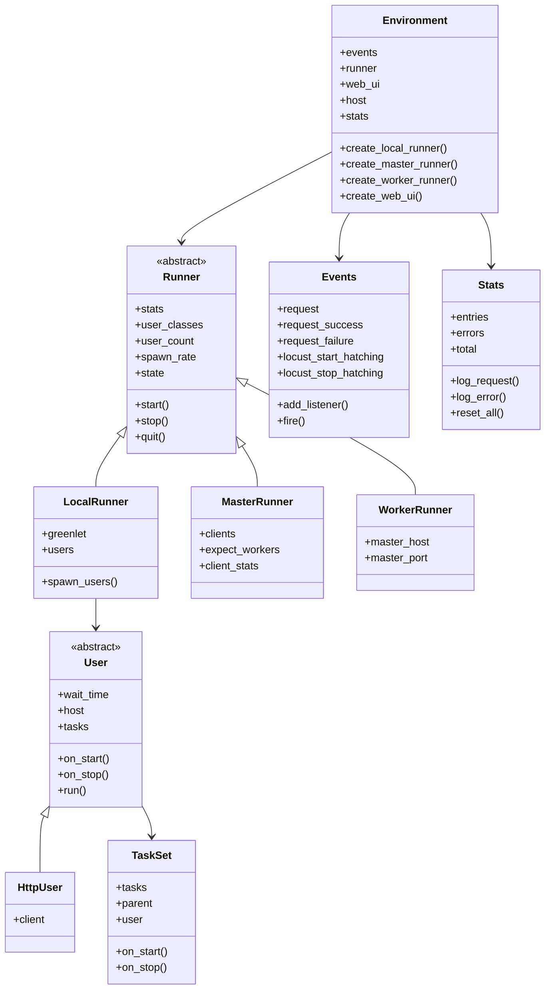

# Locust Developer Guide

This guide is intended for developers who want to modify or extend Locust. It covers the architecture, development workflow, and how to run Locust from source.

## Architecture Overview



## Extension Points

Locust is designed to be extensible in several ways. For detailed information about extending Locust with custom components, please refer to the [Custom Extensions](custom_extensions.md) guide. It covers:

1. Custom User Classes
2. Event Hooks
3. Custom Load Shapes
4. Web UI Extensions
5. Custom Clients
6. Custom Weight Distributions
7. Creating Standalone Plugins
8. Integrating with External Systems

## Development Workflow

### Setting up the Development Environment

Fork Locust on [GitHub](https://github.com/locustio/locust/) and then:

```bash
# Clone the repository
git clone git://github.com/<YourName>/locust.git
cd locust
```

Alternatively, if you're in a hurry or don't have access to a development environment, you can use [Github Codespaces](https://github.com/features/codespaces). On your fork page, just click on *Code* then on *Create codespace on <branch name>*, and you're ready to code and test.

```bash
# Install the `uv` build system
pip install uv

# [optional] Create a virtual environment and activate it
uv venv

# On Unix/macOS:
source .venv/bin/activate
# On Windows:
.venv\Scripts\activate

# Perform an editable install with all dependencies
uv sync

# [optional] Install pre-commit for automatic checks before each commit
pip install pre-commit
pre-commit install
```

Now the `uv --directory locust run locust` command will run *your* code (with no need for reinstalling after making changes). If you have installed the project to a virtual environment, you can simply call `locust`.

To contribute your changes, push to a branch in your repo and then [open a PR on GitHub](https://github.com/locustio/locust/compare).

### Running Tests

We use [hatch](https://hatch.pypa.io/) to automate tests across multiple Python versions.

All tests:
```bash
hatch test
```

Testing against a specific Python version:
```bash
hatch test -py=3.10
```

To run a specific test or test suite with pytest directly:
```bash
# All tests
pytest locust/test

# Individual test
pytest locust/test/test_main.py::DistributedIntegrationTests::test_distributed_tags
```

### Building the Web UI

To build the web UI after making changes to it:

```bash
cd locust/webui
yarn
yarn build
```

### Running Locust from Source

After making changes to the Locust source code, you can run the modified version directly without reinstalling the package:

```bash
# Run using Python module (most straightforward approach)
python -m locust -f examples/basic.py

# If installed in editable mode, you can use the locust command directly
locust -f examples/basic.py
```

#### Testing Specific Components

Locust includes example files that demonstrate different features. These are great for testing specific functionality:

```bash
# Testing Stats Collection
python -m locust -f examples/manual_stats_reporting.py

# Testing Extensions
python -m locust -f examples/extend_web_ui.py

# Testing Custom Clients
python -m locust -f examples/custom_xmlrpc_client/xmlrpc_locustfile.py

# Testing custom load shapes
python -m locust -f examples/custom_shape/step_load.py
```

#### Running in Different Modes

**Headless Mode (No UI):**
```bash
python -m locust -f examples/basic.py --headless -u 10 -r 1 -t 30s
```

**Distributed Mode:**
```bash
# Terminal 1 - Start master
python -m locust -f examples/basic.py --master

# Terminal 2 - Start worker
python -m locust -f examples/basic.py --worker
```

#### Debugging

For debugging, you can use:

```bash
# Enable debug logging
python -m locust -f examples/basic.py --loglevel DEBUG

# Using Python's built-in debugger
python -m pdb -m locust -f examples/basic.py

# Or with an IDE like VSCode or PyCharm
# Set breakpoints in your code and run using the IDE's debugging functionality
```

### Formatting and Linting

Locust uses [ruff](https://github.com/astral-sh/ruff/) for formatting and linting. The build will fail if code does not adhere to it.

```bash
# Linting
ruff --fix <file_or_folder_to_be_formatted>

# Formatting
ruff format <file_or_folder_to_be_formatted>
```

You can validate the whole project using hatch:

```bash
hatch run lint:format
```

For the web UI:
```bash
cd locust/webui
yarn format
```

### Building Documentation

The documentation source is in the `docs/` directory.

```bash
# Install the documentation requirements
uv sync --all-groups

# Build the documentation locally
make build_docs
```

View your generated documentation by opening `docs/_build/index.html` or running `make serve_docs`.

## Core Module Responsibilities

- **main.py**: Command-line interface and application entry point
- **runners.py**: Test execution management
- **stats.py**: Statistics collection and reporting
- **web.py**: Web interface backend
- **user/**: User behavior definition
- **rpc/**: Distributed test communication
- **contrib/**: Extensions for different protocols
- **webui/**: Web interface frontend

## Web UI Development

The Web UI is built using React and Typescript.

### Setup

#### Node

Install node using nvm to easily switch between node versions:

- Copy and run the install line from [nvm](https://github.com/nvm-sh/nvm) (starts with curl/wget ...)
- Verify nvm was installed correctly:
  ```bash
  nvm --version
  ```
- Install the proper Node version according to engines in the `locust/webui/package.json`:
  ```bash
  nvm install {version}
  nvm alias default {version}
  ```

#### Yarn

- Install Yarn from their official website (avoid installing through Node if possible)
- Verify yarn was installed correctly:
  ```bash
  yarn --version
  ```
- Next, install all dependencies:
  ```bash
  cd locust/webui
  yarn
  ```

### Developing

To develop while running a locust instance, run `yarn watch`. This will output the static files to the `dist` directory. Vite will automatically detect any changed files and re-build as needed. Simply refresh the page to view the changes.

In certain situations (usually when styling), you may want to develop the frontend without running a locust instance. Running `yarn dev` will start the Vite dev server and allow for viewing your changes.

To compile the webui, run `yarn build`.

The frontend can additionally be built using make:
```bash
make frontend_build
```

### Linting

Run `yarn lint` to detect lint failures in the frontend project. Running `yarn lint --fix` will resolve any issues that are automatically resolvable. Your IDE can additionally be configured with ESLint to resolve these issues on save.

### Formatting

Run `yarn format` to fix any formatting issues in the frontend project. Once again your IDE can be configured to automatically format on save.

### Typechecking

We use Typescript in the frontend project. Run `yarn type-check` to find any issues.

## Core Module Responsibilities

- **main.py**: Command-line interface and application entry point
- **runners.py**: Test execution management
- **stats.py**: Statistics collection and reporting
- **web.py**: Web interface backend
- **user/**: User behavior definition
- **rpc/**: Distributed test communication
- **contrib/**: Extensions for different protocols
- **webui/**: Web interface frontend
