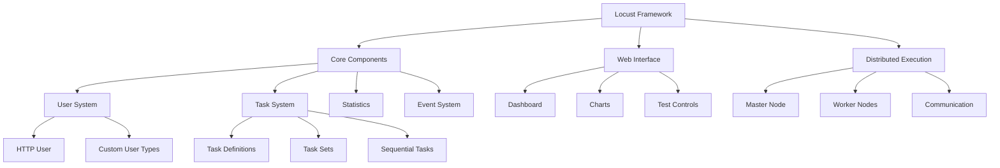
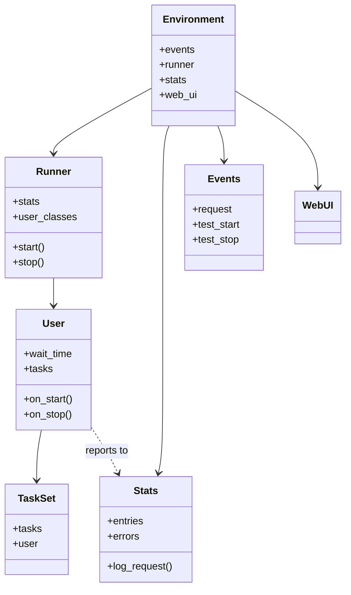
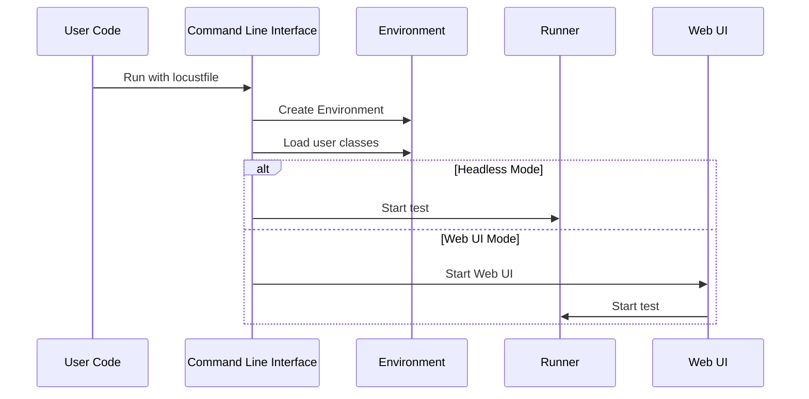

# Locust Documentation

This comprehensive documentation provides an in-depth understanding of the Locust load testing framework, its architecture, and guides for development and usage.

## Project Overview

Locust is an open-source load testing tool written in Python. It allows you to define user behavior using Python code, making it highly flexible and extensible. Unlike many other load testing tools that require learning specific domain languages or using GUIs, Locust allows you to write test scenarios in plain Python, making your tests more maintainable and easier to extend.

### Core Features

- **Python-based test definition**: Write test scenarios in regular Python code
- **Distributed load testing**: Run tests across multiple machines to generate massive load
- **Event-based architecture**: Uses gevent for high concurrency with minimal overhead
- **Web UI**: Real-time monitoring and control of tests through a web interface
- **Extensible**: Supports testing of various protocols beyond HTTP
- **Highly scalable**: Can simulate thousands of users on a single machine

### Key Concepts

#### User Classes

The fundamental building block in Locust is the `User` class, which represents a virtual user that performs tasks against the system under test. Most commonly, you'll use `HttpUser` for web testing or `FastHttpUser` for high performance testing.

```python
from locust import HttpUser, task, between

class MyUser(HttpUser):
    wait_time = between(1, 3)  # Time between tasks
    
    @task
    def my_task(self):
        self.client.get("/some-path")
```

For better performance (typically 5-6x faster), you can use `FastHttpUser`:

```python
from locust import FastHttpUser, task, between

class MyFastUser(FastHttpUser):
    wait_time = between(1, 3)
    
    @task
    def my_task(self):
        self.client.get("/some-path")
```

#### Tasks

Tasks are the actions that users perform. They are defined as methods in the User class and decorated with `@task`. You can assign different weights to tasks to control their frequency.

#### Load Shapes

Locust allows you to define custom load shapes to simulate various traffic patterns:

- Constant load
- Ramping up/down
- Step load
- Custom patterns

#### Distributed Execution

Locust can be run in distributed mode with master and worker nodes to generate significant load:

- **Master**: Controls the test and collects statistics
- **Workers**: Execute the user tasks and report back to the master



## Table of Contents

1. **[Project Structure](project_structure.md)** - Directory and file organization, file importance prioritization
2. **[Core Components](core_components.md)** - Key components and their interactions
3. **[Workflow](workflow.md)** - How Locust executes tests
4. **[Data Flow](data_flow.md)** - How data moves through the system
5. **[Developer Guide](developer_guide.md)** - Guide for developers working on Locust
6. **[Custom Extensions](custom_extensions.md)** - How to extend Locust
7. **[Deployment Guide](deployment_guide.md)** - How to deploy Locust in different environments
8. **[Contributing Guide](contributing_guide.md)** - How to contribute to Locust
9. **[Usage Patterns](usage_patterns.md)** - Common patterns and examples
10. **[Type Hints](type_hints.md)** - Using type hints with Locust for improved development experience
11. **[Modern Web UI](modern_web_ui.md)** - Features and functionality of the modern React-based UI

## Quick Start

To get started with Locust development, you should:

1. Review the project overview section above to understand the key concepts
2. Learn about the architecture from the [Core Components](core_components.md) document
3. Understand how tests execute from the [Workflow](workflow.md) document
4. Explore the detailed [Project Structure](project_structure.md) to find relevant files
5. Explore examples in the [Usage Patterns](usage_patterns.md) document
6. Set up your development environment using the [Developer Guide](developer_guide.md)

## Project Structure

The main directories in the Locust project are:

```
locust/
├── locust/              # Main source code
│   ├── user/            # User classes and task management
│   ├── contrib/         # Protocol extensions
│   ├── rpc/             # Distributed mode communication
│   ├── webui/           # Web interface
│   └── util/            # Utilities
├── examples/            # Example scripts
├── docs/                # Documentation
└── locust/test/         # Test suite
```

## Key Files and Their Roles

| File | Description |
|------|-------------|
| `locust/__init__.py` | Main imports and API |
| `locust/main.py` | Entry point and CLI handling |
| `locust/runners.py` | Test execution (local, master, worker) |
| `locust/user/users.py` | User class implementations |
| `locust/user/task.py` | Task system implementation |
| `locust/stats.py` | Statistics collection and reporting |
| `locust/web.py` | Web UI backend |
| `locust/event.py` | Event system |

## Component Relationships



## Test Execution Flow



## Extending Locust

Locust is designed to be extended in several ways:

1. **Custom User Classes** - For testing non-HTTP systems
2. **Custom Load Shapes** - For specialized load patterns
3. **Event Hooks** - For custom reporting and behavior
4. **Web UI Extensions** - For additional metrics and visualizations

See the [Custom Extensions](custom_extensions.md) document for detailed examples.

## Contributing to Locust

Locust welcomes contributions from the community. To contribute:

1. Find or create an issue in the GitHub repository
2. Fork the repository and create a branch
3. Implement your feature or fix with tests
4. Submit a pull request

See the [Contributing Guide](contributing_guide.md) for detailed instructions.

## Deployment Options

Deploy Locust in various environments:

- Local development machine
- Docker and Docker Compose
- Kubernetes
- Cloud providers (AWS, Azure, GCP)
- CI/CD pipelines

For configuration and examples, see [Deployment Guide](deployment_guide.md).

## For AI Tools

If you're using an AI tool to help with Locust development, the [Project Structure](project_structure.md) document provides guidance on which files to prioritize when loading into the context window. It includes a file importance prioritization section that ensures the AI has the most relevant information to assist with your specific task.
