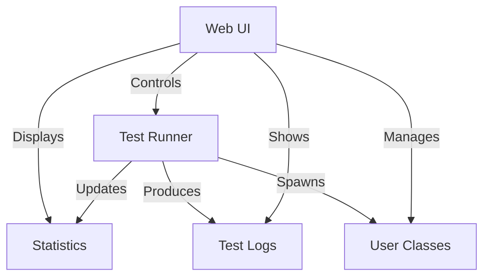

# Web UI

Locust features a web UI built with React, Material UI, and TypeScript. This document explains the features and functionality of the UI.

## Overview

The Web UI provides a responsive, feature-rich interface for controlling and monitoring Locust tests. It includes real-time charts, detailed statistics, and an intuitive user experience.

## Key Features

### 1. Dashboard with Real-time Charts

The dashboard provides at-a-glance information about the test progress, including:

- Total Request Per Second (RPS)
- Response Time Percentiles (median, 95th percentile)
- Number of Users
- Failures Per Second

The charts automatically update as the test runs, providing real-time feedback on performance.

### 2. Statistics Tables

The statistics view shows detailed metrics for each request type:

- Request counts and failure rates
- Response time statistics (min, max, average, median)
- Current throughput (requests per second)
- Percentile response times (50%, 95%, 99%, 99.9%, 99.99%)

Tables can be sorted by any column and filtered for quick analysis.

### 3. Failures Tab

The failures tab provides detailed information about any errors that occur during the test:

- Error types and counts
- Request details that caused failures
- Traceback information when available

### 4. User Class Management

When using the `--class-picker` option, the UI allows you to:

- Select which User classes to include in the test
- Adjust the weight of each User class
- Configure the total number of users and spawn rate

This provides fine-grained control over the test composition without requiring code changes.

### 5. Log Viewer

The log viewer tab displays logs from all worker nodes, allowing you to:

- Monitor test progress
- Debug issues
- See warnings and errors in real-time

### 6. Charts Tab

The charts tab provides more detailed visualizations:

- Response time distribution
- User count over time
- Request rate over time
- Failure rate over time

Charts include zoom functionality and tooltips for detailed data exploration.

## Custom Configuration

### Auth Protection

The Web UI can be protected with authentication using the `--web-login` flag. You can customize the login experience by:

- Using Flask Login
- Implementing custom form-based authentication
- Integrating with external authentication providers

### Custom Extensions

You can extend the Web UI with custom tabs and components using Flask blueprints, as described in the [Custom Extensions](custom_extensions.md) document.

## Usage with Different Modes

### Distributed Mode

In distributed mode (master/worker), the Web UI runs on the master node and displays aggregated statistics from all worker nodes. The logs panel displays logs from all workers.

### Headless Mode

When running in headless mode, the Web UI is not available, but HTML reports can be generated that use the same visual styling as the UI.

## Browser Compatibility

The Web UI is compatible with all major modern browsers:

- Chrome/Edge (Chromium-based)
- Firefox
- Safari

It also provides responsive layouts for different screen sizes, from desktop monitors to tablet devices.

## FAQ

**Q: How do I customize the appearance of the UI?**

A: The UI uses Material UI with theme support. While direct customization is not exposed as a configuration option, you can create UI extensions for custom components.

**Q: Can I export data from the UI?**

A: Yes, you can download CSV reports of statistics and failures, as well as complete HTML reports that include charts and tables.

