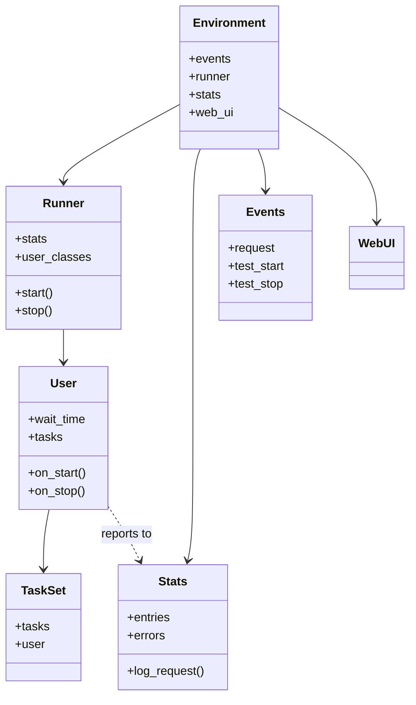
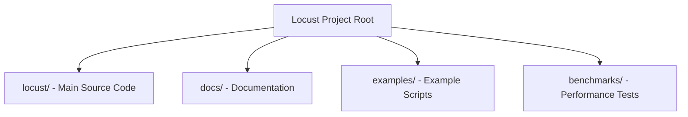
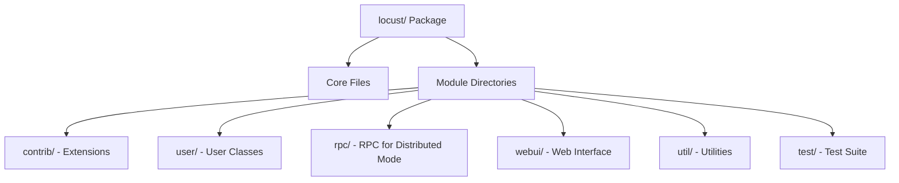
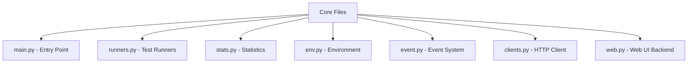
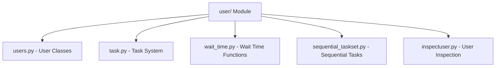
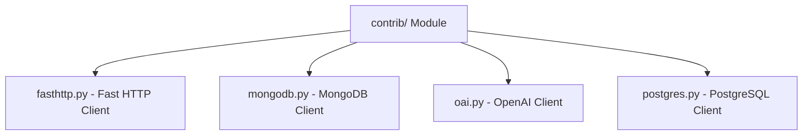
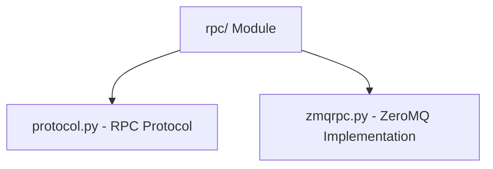
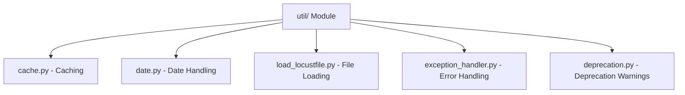
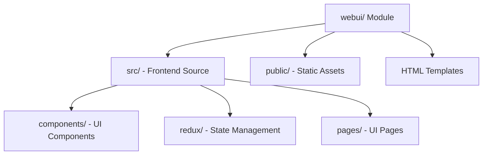
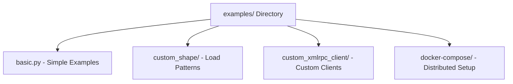

# Locust Project Structure

This document provides a comprehensive overview of the Locust project's directory structure, key components, and their relationships. It's designed to help both developers and AI tools understand how to navigate and modify the codebase efficiently.

## Key Files and Their Roles

| File | Description |
|------|-------------|
| `locust/__init__.py` | Main imports and API |
| `locust/main.py` | Entry point and CLI handling |
| `locust/runners.py` | Test execution (local, master, worker) |
| `locust/user/users.py` | User class implementations |
| `locust/user/task.py` | Task system implementation |
| `locust/stats.py` | Statistics collection and reporting |
| `locust/web.py` | Web UI backend |
| `locust/event.py` | Event system |

## Component Relationships



## Top-Level Directory Structure



## Main Source Code Structure



## Core Files



## User Module



## Contrib Module



## RPC Module



## Util Module



## WebUI Structure



## Examples Directory



## Key Components

### Core Components

- **main.py**: Main entry point for the Locust command-line interface
- **runners.py**: Contains different test runner implementations (local, master, worker)
- **stats.py**: Manages test statistics collection and reporting
- **clients.py**: HTTP client implementation for making requests
- **env.py**: Provides environment for test execution
- **event.py**: Event-based architecture implementation
- **web.py**: Web interface backend

### User System

- **users.py**: User class implementations (HttpUser, User, etc.)
- **task.py**: Task system implementation
- **wait_time.py**: Functions for controlling user wait behavior
- **sequential_taskset.py**: TaskSet implementation for sequential task execution

### Contrib

The contrib package contains extensions for testing different systems:

- **fasthttp.py**: Alternative, faster HTTP client
- **mongodb.py**: MongoDB client for testing MongoDB
- **oai.py**: OpenAI client for testing AI interfaces
- **postgres.py**: PostgreSQL client

### Test Runners

Locust supports different test runner modes:

- **LocalRunner**: For running tests on a single machine
- **MasterRunner**: For distributed testing (master node)
- **WorkerRunner**: For distributed testing (worker nodes)

## File Importance Prioritization

When analyzing or modifying the Locust project, prioritize files in the following order:

### Tier 1: Essential Files

These files provide core understanding of the project:

- `locust/__init__.py` - Core imports and API
- `locust/main.py` - Entry point and CLI handling
- `locust/user/users.py` - User class definitions
- `locust/user/task.py` - Task system implementation
- `README.md` - Project overview

### Tier 2: High-Priority Files

These files contain key functionality:

- `locust/runners.py` - Test runners (local, master, worker)
- `locust/stats.py` - Statistics collection
- `locust/env.py` - Environment management
- `locust/web.py` - Web UI backend
- `locust/event.py` - Event system
- `locust/clients.py` - HTTP client implementation

### Tier 3: Task-Specific Files

Load these based on the specific task being performed:

#### For HTTP Testing Modifications
- `locust/contrib/fasthttp.py` - Fast HTTP client

#### For Web UI Modifications
- `locust/webui/src/App.tsx` - Web UI main app
- `locust/webui/src/components/*` - UI components

#### For Custom Client Development
- `locust/contrib/mongodb.py` - MongoDB client example
- `locust/contrib/postgres.py` - PostgreSQL client example

#### For Load Shaping
- `locust/shape.py` - Load test shapes

#### For Distributed Testing
- `locust/rpc/protocol.py` - RPC protocol
- `locust/rpc/zmqrpc.py` - ZeroMQ implementation

## Detailed File Structure 

The following is a detailed tree of the most important directories and files in the Locust project:

```
locust/
├── __init__.py            # Core API and imports
├── __main__.py            # Entry point for module execution
├── _version.py            # Version information
├── main.py                # CLI and main application logic
├── runners.py             # Test runners implementation
├── stats.py               # Statistics collection and reporting
├── env.py                 # Environment setup and management
├── event.py               # Event system
├── clients.py             # HTTP client implementation
├── web.py                 # Web UI backend
├── shape.py               # Load test shapes
├── argument_parser.py     # Command line argument parsing
├── dispatch.py            # Task dispatch mechanism
├── exception.py           # Custom exceptions
├── html.py                # HTML report generation
├── log.py                 # Logging setup
├── user/
│   ├── __init__.py        # User package initialization
│   ├── users.py           # User class definitions
│   ├── task.py            # Task system implementation
│   ├── wait_time.py       # Wait time functions
│   ├── sequential_taskset.py # Sequential task execution
│   └── inspectuser.py     # User inspection utilities
├── contrib/
│   ├── __init__.py        # Contrib package initialization
│   ├── fasthttp.py        # Fast HTTP client
│   ├── mongodb.py         # MongoDB client
│   ├── postgres.py        # PostgreSQL client
│   └── oai.py             # OpenAI client
├── rpc/
│   ├── __init__.py        # RPC package initialization
│   ├── protocol.py        # RPC protocol definition
│   └── zmqrpc.py          # ZeroMQ implementation
├── util/
│   ├── __init__.py        # Util package initialization
│   ├── cache.py           # Caching utilities
│   ├── deprecation.py     # Deprecation warnings
│   ├── load_locustfile.py # Locustfile loading
│   ├── timespan.py        # Time span calculation
│   └── [other utility files]
├── webui/                 # Web UI frontend (React/TypeScript)
│   ├── src/
│   │   ├── App.tsx        # Main application
│   │   ├── components/    # UI components
│   │   ├── redux/         # State management
│   │   └── [other frontend files]
│   ├── index.html         # Main HTML template
│   └── [other web files]
└── test/                  # Test suite
    ├── __init__.py
    ├── test_locust_class.py
    ├── test_runners.py
    ├── test_stats.py
    └── [other test files]
```

## File Selection Guide for Common Tasks

When performing common modification tasks, focus on these specific files:

### 1. Adding a New HTTP Feature

Key files:
- `locust/clients.py` - Main HTTP client
- `locust/contrib/fasthttp.py` - Fast HTTP client implementation
- Example HTTP user: `examples/basic.py`

### 2. Extending the Web UI

Key files:
- `locust/web.py` - Backend implementation
- `locust/webui/src/App.tsx` - Main application component
- `locust/webui/src/components/` - UI components
- Example UI extension: `examples/extend_web_ui.py`

### 3. Creating a Custom Load Shape

Key files:
- `locust/shape.py` - Base load shape class
- Examples: `examples/custom_shape/`

### 4. Implementing a Custom Protocol Client

Key files:
- `locust/contrib/mongodb.py` - Example MongoDB client
- `locust/contrib/postgres.py` - Example PostgreSQL client
- Custom client examples: `examples/custom_xmlrpc_client/`

### 5. Working with Distributed Mode

Key files:
- `locust/runners.py` - Contains MasterRunner and WorkerRunner
- `locust/rpc/protocol.py` - RPC protocol
- `locust/rpc/zmqrpc.py` - ZeroMQ implementation

This comprehensive guide helps both developers and AI tools efficiently navigate the Locust codebase, making it easier to understand the project structure and find the relevant files for specific tasks.
