# Locust Workflow

This document describes the workflow of Locust during test execution, from initialization to results reporting.

## Test Execution Flow

```mermaid
sequenceDiagram
    participant User as User Code
    participant CLI as Command Line Interface
    participant Env as Environment
    participant Runner as Runner
    participant WebUI as Web UI
    participant UserInstance as User Instance
    participant Stats as Statistics

    User->>CLI: Run with locustfile
    CLI->>Env: Create Environment
    CLI->>Env: Load user classes
    
    alt Headless Mode
        CLI->>Runner: Create Runner
        CLI->>Runner: Start test (users, spawn_rate)
    else Web UI Mode
        CLI->>WebUI: Start Web UI
        WebUI->>Runner: Create Runner
        WebUI-->>User: Display UI in browser
        User->>WebUI: Configure test parameters
        User->>WebUI: Start test
        WebUI->>Runner: Start test (users, spawn_rate)
    end
    
    Runner->>Runner: Spawn user instances
    
    loop For each user to spawn
        Runner->>UserInstance: Create User instance
        UserInstance->>UserInstance: on_start()
        UserInstance->>UserInstance: Start task execution
    end
    
    loop Until test ends
        UserInstance->>UserInstance: Select task
        UserInstance->>UserInstance: Execute task
        UserInstance->>Stats: Report request result
        UserInstance->>UserInstance: Wait
        Stats-->>WebUI: Update statistics
    end
    
    alt Test ends naturally
        Runner->>UserInstance: Stop all users
        UserInstance->>UserInstance: on_stop()
    else User interrupts
        User->>WebUI: Stop test
        WebUI->>Runner: Stop test
        Runner->>UserInstance: Stop all users
        UserInstance->>UserInstance: on_stop()
    end
    
    Runner->>Stats: Generate final report
    Stats-->>User: Display statistics
```

## Detailed Workflow Description

### 1. Initialization

1. **Main Entry Point**: The process starts in `main.py` when the user runs the `locust` command.
2. **Parse Arguments**: Command-line arguments are parsed using `argument_parser.py`.
3. **Load Locustfile**: The specified locustfile is loaded using `util/load_locustfile.py`.
4. **Create Environment**: An Environment instance is created to hold the test configuration.
5. **Create Runner**: Based on the mode (local, master, worker), the appropriate runner is created.

### 2. Test Configuration

In web UI mode:
1. **Start Web UI**: The web UI is started on the specified port.
2. **User Configuration**: The user configures the test parameters through the web interface (using the modern React-based UI).
3. **Start Test**: The user clicks the "Start" button to begin the test.
4. **User Class Selection**: If `--class-picker` was specified, users can select which User classes to include and adjust their weights.

In headless mode:
1. **Parse Command Line**: Test parameters are taken from command-line arguments.
2. **Start Test**: The test starts automatically with the specified parameters.

### 3. Test Execution

1. **Spawn Users**: The runner spawns user instances according to the spawn rate.
2. **User Initialization**: For each user, the `on_start` method is called.
3. **Task Execution**: Users start executing their tasks.
   - Tasks are selected based on their weight.
   - HTTP requests (or other actions) are performed.
   - Results are reported to the statistics collector.
   - Users wait according to their wait_time function.
4. **Statistics Collection**: All request results are collected and aggregated.
5. **Real-time Reporting**: In web UI mode, statistics are continuously updated.

### 4. Test Completion

1. **Stop Users**: Either due to run_time limit, shape completion, or user interaction, users are stopped.
2. **User Cleanup**: The `on_stop` method is called for each user.
3. **Generate Report**: Final statistics are compiled.
4. **Export Results**: Results may be exported to CSV, HTML, or other formats.

## Distributed Mode Workflow

## User Task Execution Flow

## Request Handling and Statistics Flow

