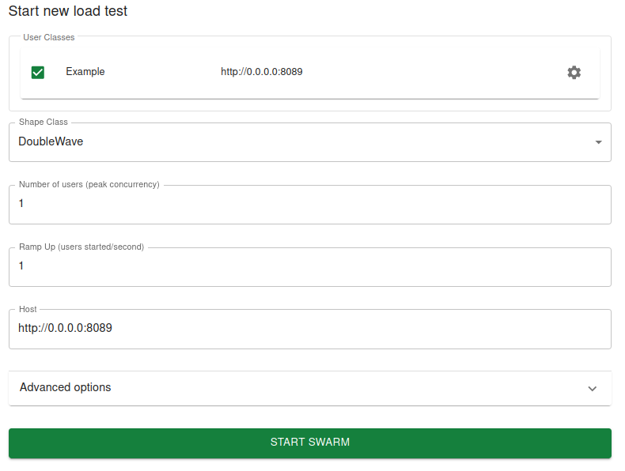

.. _configuration:

=============
Configuration
=============

Command Line Options
====================

Locust is configured mainly through command line arguments.

.. code-block:: console

    $ locust --help

.. literalinclude:: cli-help-output.txt
    :language: console

.. _environment-variables:

Environment Variables
=====================

Options can also be set through environment variables. They are typically the same as the command line argument
but capitalized and prefixed with ``LOCUST_``:

On Linux/macOS:

.. code-block::

    $ LOCUST_LOCUSTFILE=custom_locustfile.py locust

On Windows:

.. code-block::

    > set LOCUST_LOCUSTFILE=custom_locustfile.py
    > locust

.. _configuration-file:

Configuration File
==================

Options can also be set in a configuration file in the
`config or TOML file format <https://github.com/bw2/ConfigArgParse#config-file-syntax>`_.

Locust will look for ``~/.locust.conf``, ``./locust.conf`` and ``./pyproject.toml`` by default.
You can specify an additional file using the ``--config`` flag.

.. code-block:: console

    $ locust --config custom_config.conf

Here's an example:

locust.conf
--------------

.. code-block:: ini

    locustfile = locust_files/my_locust_file.py
    headless = true
    master = true
    expect-workers = 5
    host = https://target-system
    users = 100
    spawn-rate = 10
    run-time = 10m
    tags = [Critical, Normal]

Have a look later in this page for `All available configuration options`_

pyproject.toml
--------------

When using a TOML file, configuration options should be defined within the ``[tool.locust]`` section.

.. code-block:: toml

    [tool.locust]
    locustfile = "locust_files/my_locust_file.py"
    headless = true
    master = true
    expect-workers = 5
    host = "https://target-system"
    users = 100
    spawn-rate = 10
    run-time = "10m"
    tags = ["Critical", "Normal"]

.. note::

    Configuration values are read (and overridden) in the following order:

    .. code-block:: console

       ./pyproject.toml -> ./locust.conf -> (file specified using --config) -> env vars -> cmd args

All available configuration options
===================================

Here's a table of all the available configuration options, and their corresponding Environment and config file keys:

.. include:: config-options.rst

Running without the web UI
==========================

See :ref:`running-without-web-ui`

Using multiple Locustfiles at once
==================================

``-f/--locustfile`` accepts multiple, comma-separated locustfiles.

Example:

With the following file structure:

.. code-block::

    ├── locustfiles/
    │   ├── locustfile1.py
    │   ├── locustfile2.py
    │   └── more_files/
    │       ├── locustfile3.py
    │       ├── _ignoreme.py

.. code-block:: console

    $ locust -f locustfiles/locustfile1.py,locustfiles/locustfile2.py,locustfiles/more_files/locustfile3.py

Locust will use ``locustfile1.py``, ``locustfile2.py`` & ``more_files/locustfile3.py``

Additionally, ``-f/--locustfile`` accepts directories as an option. Locust will recursively
search specified directories for ``*.py`` files, ignoring files that start with "_".

Example:

.. code-block:: console

    $ locust -f locustfiles

Locust will use ``locustfile1.py``, ``locustfile2.py`` & ``more_files/locustfile3.py``

You can also use ``-f/--locustfile`` for web urls. This will download the file and use it as any normal locustfile.

Example:

.. code-block:: console

    $ locust -f https://raw.githubusercontent.com/locustio/locust/master/examples/basic.py

.. _class-picker:

Pick User classes, Shapes and tasks from the UI
===============================================

You can select which Shape class and which User classes to run in the WebUI when running locust with the ``--class-picker`` flag.
No selection uses all the available User classes.

For example, with a file structure like this:

.. code-block::

    ├── src/
    │   ├── some_file.py
    ├── locustfiles/
    │   ├── locustfile1.py
    │   ├── locustfile2.py
    │   └── more_files/
    │       ├── locustfile3.py
    │       ├── _ignoreme.py
    │   └── shape_classes/
    │       ├── DoubleWaveShape.py
    │       ├── StagesShape.py

.. code-block:: console

    $ locust -f locustfiles --class-picker

The Web UI will display:

The class picker additionally allows for disabling individual User tasks, changing the weight or fixed count, and configuring the host.

It is even possible to add custom attributes that you wish to be configurable for each User. Simply add a ``json`` classmethod
to your user:

.. code-block:: python

    class Example(HttpUser):
        some_custom_arg: str = "example"

        @task
        def example_task(self):
            self.client.get(f"/example/{self.some_custom_arg}")

        @classmethod
        def json(cls):
            return {
                "host": cls.host,
                "some_custom_arg": cls.some_custom_arg
            }

.. note::

    The ``json`` classmethod is only used to populate the class picker UI (the gear icon next to each User class).
    It does not automatically set the attribute values on the User class. The default values must be defined as
    class-level attributes (e.g. ``some_custom_arg: str = "example"``). To apply changes made in the UI, click the
    save button for each User class.

Configure Users from command line
=================================

You can update User class attributes from the command line too, using the ``--config-users`` argument:

.. code-block:: console

    $ locust --config-users '{"user_class_name": "Example", "fixed_count": 1, "some_custom_attribute": false}'

To configure multiple users you pass multiple arguments to ``--config-users``, or use a JSON Array. You can also pass a path to a JSON file.

.. code-block:: console

    $ locust --config-users '{"user_class_name": "Example", "fixed_count": 1}' '{"user_class_name": "ExampleTwo", "fixed_count": 2}'
    $ locust --config-users '[{"user_class_name": "Example", "fixed_count": 1}, {"user_class_name": "ExampleTwo", "fixed_count": 2}]'
    $ locust --config-users my_user_config.json

When using this way to configure your users, you can set any attribute.

.. note::

    ``--config-users`` is a somewhat experimental feature and the json format may change even between minor Locust revisions.

Configuring Profiles
====================

Profiles are an advanced feature that allow for grouping and filtering testruns. A profile may be set using the ``--profile`` argument
or by inputting a value in the advanced options from the web ui.

It may be useful to see a list of existing profiles as options in the form. If you have such a list, you may set it in your locustfile:

.. code-block:: python

    from locust import events

    @events.init.add_listener
    def on_locust_init(environment, **kwargs):
        environment.web_ui.template_args["all_profiles"] = ["one", "two", "three"]

.. _custom-load-shape:

Custom load shapes
==================

Sometimes a completely custom shaped load test is required that cannot be achieved by simply setting or changing the user count and spawn rate. For example, you might want to generate a load spike or ramp up and down at custom times. By using a `LoadTestShape` class you have full control over the user count and spawn rate at all times.

Define a class inheriting the LoadTestShape class in your locust file. If this type of class is found then it will be automatically used by Locust.

In this class you define a `tick()` method that returns a tuple with the desired user count and spawn rate (or `None` to stop the test). Locust will call the `tick()` method approximately once per second.

In the class you also have access to the `get_run_time()` method, for checking how long the test has run for.

Example
-------

This shape class will increase user count in blocks of 100 and then stop the load test after 10 minutes:

.. code-block:: python

    class MyCustomShape(LoadTestShape):
        time_limit = 600
        spawn_rate = 20
        
        def tick(self):
            run_time = self.get_run_time()

            if run_time < self.time_limit:
                # User count rounded to nearest hundred.
                user_count = round(run_time, -2)
                return (user_count, self.spawn_rate)

            return None

This functionality is further demonstrated in the `examples on github <https://github.com/locustio/locust/tree/master/examples/custom_shape>`_ including:

- Generating a double wave shape
- Time based stages like K6
- Step load pattern like Visual Studio

One further method may be helpful for your custom load shapes: `get_current_user_count()`, which returns the total number of active users. This method can be used to prevent advancing to subsequent steps until the desired number of users has been reached. This is especially useful if the initialization process for each user is slow or erratic in how long it takes. If this sounds like your use case, see the `example on github <https://github.com/locustio/locust/tree/master/examples/custom_shape/wait_user_count.py>`_.

Note that if you want to defined your own custom base shape, you need to define the `abstract` attribute to `True` to avoid it being picked as Shape when imported:

.. code-block:: python

    class MyBaseShape(LoadTestShape):
        abstract = True
        
        def tick(self):
            # Something reusable but needing inheritance
            return None

Combining Users with different load profiles
--------------------------------------------

If you use the Web UI, you can add the :ref:`---class-picker <class-picker>` parameter to select which shape to use. But it often more flexible to have your User definitions in one file and your LoadTestShape in a separate one. For example, if you a high/low load Shape class defined in low_load.py and high_load.py respectively:

.. code-block:: console

    $ locust -f locustfile.py,low_load.py

    $ locust -f locustfile.py,high_load.py

Restricting which user types to spawn in each tick
--------------------------------------------------

Adding the element ``user_classes`` to the return value gives you more detailed control:

.. code-block:: python

    class StagesShapeWithCustomUsers(LoadTestShape):

        stages = [
            {"duration": 10, "users": 10, "spawn_rate": 10, "user_classes": [UserA]},
            {"duration": 30, "users": 50, "spawn_rate": 10, "user_classes": [UserA, UserB]},
            {"duration": 60, "users": 100, "spawn_rate": 10, "user_classes": [UserB]},
            {"duration": 120, "users": 100, "spawn_rate": 10, "user_classes": [UserA,UserB]},
        ]

        def tick(self):
            run_time = self.get_run_time()

            for stage in self.stages:
                if run_time < stage["duration"]:
                    try:
                        tick_data = (stage["users"], stage["spawn_rate"], stage["user_classes"])
                    except:
                        tick_data = (stage["users"], stage["spawn_rate"])
                    return tick_data

            return None

This shape would create in the first 10 seconds 10 User of ``UserA``. In the next twenty seconds 40 of type ``UserA / UserB`` and this continues until the stages end.

.. _use-common-options:

Reusing common options in custom shapes
---------------------------------------

When using shapes, the *Users*, *Spawn Rate* and *Run Time* options will be hidden from the UI, and if you specify them on command line Locust will log a warning. This is because those options don't directly apply to shapes, and specifying them might be a mistake.

If you really want to combine a shape with these options, set the ``use_common_options`` attribute and access them from ``self.runner.environment.parsed_options``:

.. code-block:: python

    class MyCustomShape(LoadTestShape):
        use_common_options = True
        
        def tick(self):
            run_time = self.get_run_time()
            if run_time < self.runner.environment.parsed_options.run_time:
                # User count rounded to nearest hundred, just like in previous example
                user_count = round(run_time, -2)
                return (user_count, self.runner.environment.parsed_options.spawn_rate)
                
            return None

Save test statistics in CSV format
==================================

When running Locust with the web UI, you can retrieve CSV files under the Download Data tab. 

Or you can run Locust with a flag which will periodically save four CSV files. This is particularly useful
if you plan on running Locust in an automated way with the ``--headless`` flag:

.. code-block:: console

    $ locust -f examples/basic.py --csv example --headless -t10m

The files will be named ``example_stats.csv``, ``example_failures.csv``, ``example_exceptions.csv`` and ``example_stats_history.csv``
(when using ``--csv example``). The first two files will contain the stats and failures for the whole 
test run, with a row for every stats entry (URL endpoint) and an aggregated row. The ``example_stats_history.csv`` 
will get new rows with the *current* (10 seconds sliding window) stats appended during the whole test run. 
By default only the Aggregate row is appended regularly to the history stats, but if Locust is started with 
the ``--csv-full-history`` flag, a row for each stats entry (and the Aggregate) is appended every time 
the stats are written (once every 2 seconds by default).

You can also customize how frequently this is written:

.. code-block:: python

    import locust.stats
    locust.stats.CSV_STATS_INTERVAL_SEC = 5 # default is 1 second

Custom arguments
================

See :ref:`custom-arguments`

Customization of statistics settings
====================================

Default configuration for Locust statistics is set in constants of stats.py file.
It can be tuned to specific requirements by overriding these values.
To do this, import locust.stats module and override required settings:

.. code-block:: python

    import locust.stats
    locust.stats.CONSOLE_STATS_INTERVAL_SEC = 15

It can be done directly in Locust file or extracted to separate file for common usage by all Locust files.

The list of statistics parameters that can be modified is:

+-----------------------------------------+----------------------------------------------------------------------------------+----------------------------------------------------------------------+
| Parameter name                          | Purpose                                                                          | Default value                                                        |
+-----------------------------------------+----------------------------------------------------------------------------------+----------------------------------------------------------------------+
| STATS_NAME_WIDTH                        | Width of column for request name in console output                               | terminal size or 80                                                  |
+-----------------------------------------+----------------------------------------------------------------------------------+----------------------------------------------------------------------+
| STATS_TYPE_WIDTH                        | Width of column for request type in console output                               | 8                                                                    |
+-----------------------------------------+----------------------------------------------------------------------------------+----------------------------------------------------------------------+
| CSV_STATS_INTERVAL_SEC                  | Interval for how frequently the CSV file is written if this option is configured | 1                                                                    |
+-----------------------------------------+----------------------------------------------------------------------------------+----------------------------------------------------------------------+
| CONSOLE_STATS_INTERVAL_SEC              | Interval for how frequently results are written to console / chart UI            | 2                                                                    |
+-----------------------------------------+----------------------------------------------------------------------------------+----------------------------------------------------------------------+
| HISTORY_STATS_INTERVAL_SEC              | Interval for how frequently results are written to history                       | 5                                                                    |
+-----------------------------------------+----------------------------------------------------------------------------------+----------------------------------------------------------------------+
| CURRENT_RESPONSE_TIME_PERCENTILE_WINDOW | Window size/resolution - in seconds - when calculating the current response      | 10                                                                   |
|                                         | time percentile                                                                  |                                                                      |
+-----------------------------------------+----------------------------------------------------------------------------------+----------------------------------------------------------------------+
| PERCENTILES_TO_REPORT                   | List of response time percentiles to be calculated & reported                    | [0.50, 0.66, 0.75, 0.80, 0.90, 0.95, 0.98, 0.99, 0.999, 0.9999, 1.0] |
+-----------------------------------------+----------------------------------------------------------------------------------+----------------------------------------------------------------------+
| PERCENTILES_TO_STATISTICS               | List of response time percentiles in the screen of statistics for UI             | [0.95, 0.99]                                                         |
+-----------------------------------------+----------------------------------------------------------------------------------+----------------------------------------------------------------------+
| PERCENTILES_TO_CHART                    | List of response time percentiles in the screen of chart for UI                  | [0.5, 0.95]                                                          |
+-----------------------------------------+----------------------------------------------------------------------------------+----------------------------------------------------------------------+

.. _customizing-response-time-bucketing:

Customizing response time bucketing
====================================

Response times are grouped into histogram buckets before being stored in the
``response_times`` dict. By default, Locust rounds to approximately 2 significant
digits (e.g. 147 becomes 150, 3432 becomes 3400). This keeps the dict small,
which matters in distributed mode where the dict is serialized from workers to master.

You can replace the bucketing function to change this behaviour:

.. code-block:: python

    import locust.stats
    from math import floor, log10

    def my_bucket_function(response_time: int | float) -> int:
        """Example: bucket to 3 significant figures."""
        if response_time == 0:
            return 0
        return int(round(response_time, -int(floor(log10(abs(response_time)))) + 2))

    locust.stats.bucket_response_time = my_bucket_function

The replacement function receives a single numeric argument (the response time in
milliseconds) and must return a numeric value to use as the dict key. Keep in mind
that more unique keys means more data transferred in distributed mode.

Customization of additional static variables
============================================

This table lists the constants that are set within locust and may be overridden.

+-------------------------------------------+--------------------------------------------------------------------------------------+
| Parameter name                            | Purpose                                                                              |
+-------------------------------------------+--------------------------------------------------------------------------------------+
| locust.runners.WORKER_LOG_REPORT_INTERVAL | Interval for how frequently worker logs are reported to master. Can be disabled      |
|                                           | by setting to a negative number                                                      |
+-------------------------------------------+--------------------------------------------------------------------------------------+
| locust.web.HOST_IS_REQUIRED               | Makes the host field for the webui required                                          |
+-------------------------------------------+--------------------------------------------------------------------------------------+
