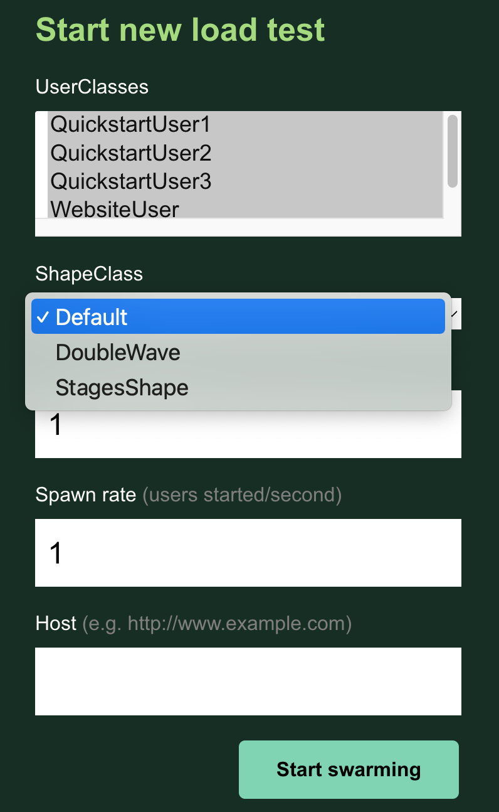

.. _configuration:

=============
Configuration
=============

Command Line Options
====================

Locust is configured mainly through command line arguments.

.. code-block:: console

    $ locust --help

.. literalinclude:: cli-help-output.txt
    :language: console

.. _environment-variables:

Environment Variables
=====================

Options can also be set through through environment variables. They are typically the same as the command line argument but capitalized and prefixed with ``LOCUST_``:

On Linux/macOS:

.. code-block::

    $ LOCUST_LOCUSTFILE=custom_locustfile.py locust

On Windows:

.. code-block::

    > set LOCUST_LOCUSTFILE=custom_locustfile.py
    > locust

.. _configuration-file:

Configuration File
==================

Options can also be set in a configuration file in the `config file <https://github.com/bw2/ConfigArgParse#config-file-syntax>`_
format. 

Locust will look for ``~/.locust.conf`` and ``./locust.conf`` by default, and you can specify an 
additional file using the ``--config`` flag.

Example:

.. code-block::

    # master.conf in current directory
    locustfile = locust_files/my_locust_file.py
    headless = true
    master = true
    expect-workers = 5
    host = https://target-system
    users = 100
    spawn-rate = 10
    run-time = 10m
    

.. code-block:: console

    $ locust --config master.conf

.. note::

    Configuration values are read (overridden) in the following order:
    
    .. code-block:: console
        
        ~/locust.conf -> ./locust.conf -> (file specified using --conf) -> env vars -> cmd args

All available configuration options
===================================

Here's a table of all the available configuration options, and their corresponding Environment and config file keys:

.. include:: config-options.rst

Running without the web UI
==========================

See :ref:`running-without-web-ui`

Using multiple Locustfiles at once
==================================

The ``-f/--locustfile`` option accepts a single directory of locustfiles as an option. Locust will recursively
search the directory for ``*.py`` files, ignoring files named ``locust.py`` or those that start with "_".

Example:

With the following file structure:

.. code-block::

    ├── locustfiles/
    │   ├── locustfile1.py
    │   ├── locustfile2.py
    │   └── more_files/
    │       ├── locustfile3.py
    │       ├── locust.py
    │       ├── _ignoreme.py

.. code-block:: console

    $ locust -f locustfiles

Locust will use ``locustfile1.py``, ``locustfile2.py`` & ``more_files/locustfile3.py``

Additionally, ``-f/--locustfile`` accepts multiple, comma-separated locustfiles.

Example:

.. code-block:: console

    $ locust -f locustfiles/locustfile1.py,locustfiles/locustfile2.py,locustfiles/more_files/locustfile3.py

Locust will use ``locustfile1.py``, ``locustfile2.py`` & ``more_files/locustfile3.py``

.. _class-picker:

Running Locust with User class UI picker
========================================

You can select which Shape class and which User classes to run in the WebUI when running locust with the ``--class-picker`` flag.
No selection uses all of the available User classes.

Example:

With the following file structure:

.. code-block::

    ├── src/
    │   ├── some_file.py
    ├── locustfiles/
    │   ├── locustfile1.py
    │   ├── locustfile2.py
    │   └── more_files/
    │       ├── locustfile3.py
    │       ├── locust.py
    │       ├── _ignoreme.py
    │   └── shape_classes/
    │       ├── DoubleWaveShape.py
    │       ├── StagesShape.py

.. code-block:: console

    $ locust -f locustfiles --class-picker

The Web UI will display:

|

With the new ``--modern-ui``, the class picker will addtionally allow for configuring any settings for each selected user.
This includes selecting tasks, configuring the weight or fixed count, and configuring the host.

It is even possible to add custom arguments that you wish to be configurable for each user. Simply add a ``json`` classethod
to your user:

.. code-block:: python
    class Example(HttpUser):
        @task
        def example_task(self):
            self.client.get(f"/example/{self.some_custom_arg}")

        @classmethod
        def json(self):
            return {
                "host": self.host,
                "some_custom_arg": "example"
            }

Configuration for the User classes
==================================

You can configure any settings you may wish for each user on the command line, the same as you may in the modern UI.
Using the ``--config-users`` argument, you may pass a JSON string or file with your user configuration. To configure
multiple users you pass multiple arguments to ``--config-users`` or use a JSON Array.

Each user settings object must contain a key ``user_class_name``. This key corresponds to the class that you wish
to configure.

Example:

.. code-block:: console

    $ locust --config-users '{"user_class_name": "Example", "fixed_count": 1}'
    $ locust --config-users '[{"user_class_name": "Example", "fixed_count": 1}, {"user_class_name": "ExampleTwo", "fixed_count": 2}]'
    $ locust --config-users '{"user_class_name": "Example", "fixed_count": 1}' '{"user_class_name": "ExampleTwo", "fixed_count": 2}'
    $ locust --config-users config_users.json

Custom arguments
================

See :ref:`custom-arguments`

Customization of statistics settings
====================================

Default configuration for Locust statistics is set in constants of stats.py file.
It can be tuned to specific requirements by overriding these values.
To do this, import locust.stats module and override required settings:

.. code-block:: python

    import locust.stats
    locust.stats.CONSOLE_STATS_INTERVAL_SEC = 15

It can be done directly in Locust file or extracted to separate file for common usage by all Locust files.

The list of statistics parameters that can be modified is:

+-------------------------------------------+--------------------------------------------------------------------------------------+
| Parameter name                            | Purpose                                                                              |
+-------------------------------------------+--------------------------------------------------------------------------------------+
| STATS_NAME_WIDTH                          | Width of column for request name in console output                                   |
+-------------------------------------------+--------------------------------------------------------------------------------------+
| STATS_TYPE_WIDTH                          | Width of column for request type in console output                                   |
+-------------------------------------------+--------------------------------------------------------------------------------------+
| CSV_STATS_INTERVAL_SEC                    | Interval for how frequently the CSV file is written if this option is configured     |
+-------------------------------------------+--------------------------------------------------------------------------------------+
| CONSOLE_STATS_INTERVAL_SEC                | Interval for how frequently results are written to console                           |
+-------------------------------------------+--------------------------------------------------------------------------------------+
| CURRENT_RESPONSE_TIME_PERCENTILE_WINDOW   | Window size/resolution - in seconds - when calculating the current response          |
|                                           | time percentile                                                                      |
+-------------------------------------------+--------------------------------------------------------------------------------------+
| PERCENTILES_TO_REPORT                     | List of response time percentiles to be calculated & reported                        |
+-------------------------------------------+--------------------------------------------------------------------------------------+
| PERCENTILES_TO_CHART                      | List of response time percentiles in the screen of chart for Web UI                  |
+-------------------------------------------+--------------------------------------------------------------------------------------+
| PERCENTILES_TO_STATISTICS                 | List of response time percentiles in the screen of statistics for Web UI             |
|                                           | This parameter supports only modern UI                                               |
+-------------------------------------------+--------------------------------------------------------------------------------------+

