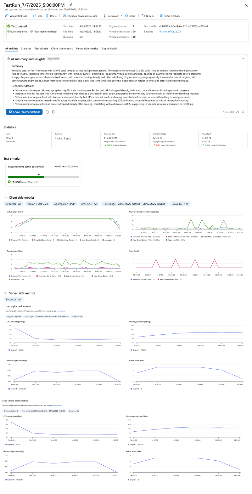

.. _hosted-load-testing:

Hosted load testing
===================

.. raw:: html

   

     
     
<a class="reference external" href="https://learn.microsoft.com/azure/app-testing/load-testing/overview-what-is-azure-load-testing">Azure Load Testing</a> is a Microsoft-managed load testing service that lets you execute Locust tests in the cloud.

   

It is the easiest way to get started with large-scale tests and adds a lot of benefits:

* Scalable and flexible, with no need to set up your own infrastructure.
* Efficient, with no load generator costs while tests are not running.
* Built in reporting and analysis tools, with `Azure Application Insights <https://learn.microsoft.com/azure/azure-monitor/app/app-insights-overview>`_ integration.
* CI/CD support, with Azure DevOps and GitHub Actions.

Microsoft contributes to and sponsors the maintenance of Locust ❤️

If you're using VS Code, you can use the `Azure Load Testing extension <https://github.com/microsoft/azureloadtesting-extension/blob/main/README.md>`_ to create and run tests in Azure Load Testing directly from your editor.
