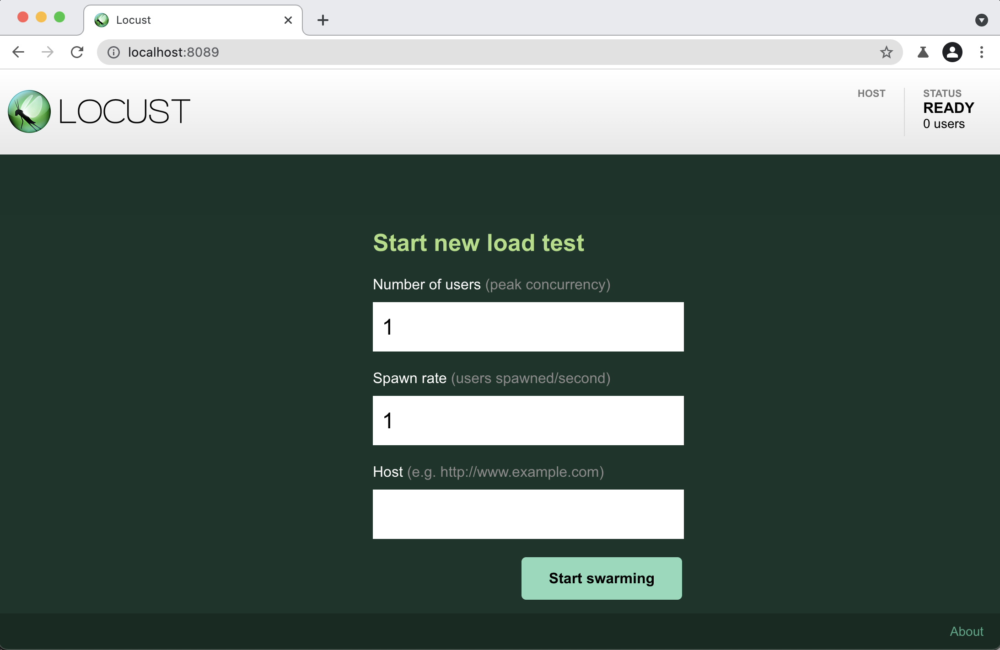
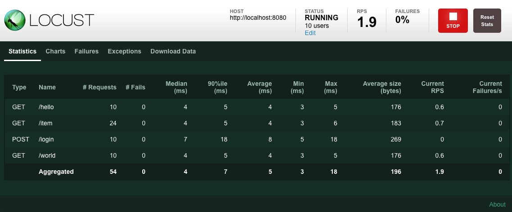
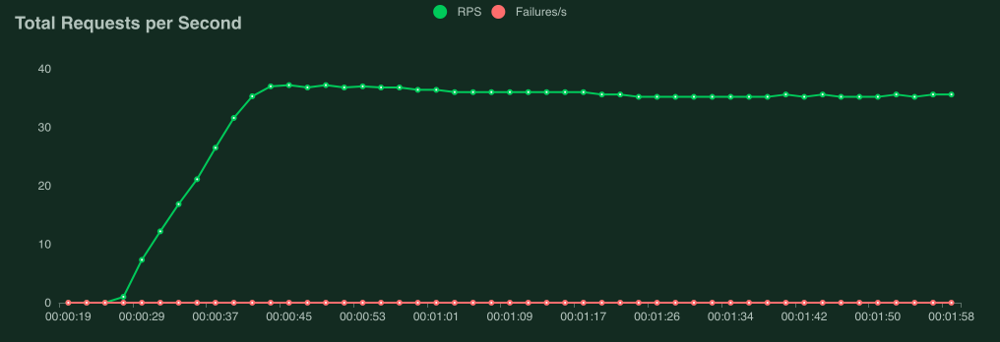
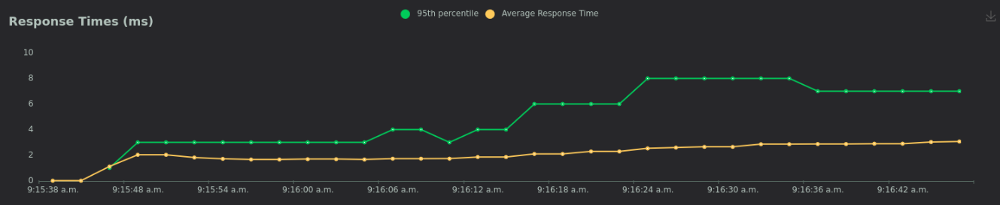
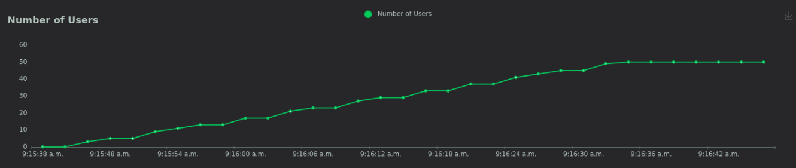

.. _quickstart:

===============
Getting started
===============

A Locust test is essentially a Python program. This makes it very flexible and particularly good at implementing complex user flows. But it can do simple tests as well, so lets start with that:

.. code-block:: python

    from locust import HttpUser, task

    class HelloWorldUser(HttpUser):
        @task
        def hello_world(self):
            self.client.get("/hello")
            self.client.get("/world")

This user will make HTTP requests to ``/hello``, and then ``/world``, again and again. For a full explanation and a more realistic example see :ref:`writing-a-locustfile`.

Put the code in a file named *locustfile.py* in your current directory and run ``locust``:

.. code-block:: console
    :substitutions:

    $ locust
    [2021-07-24 09:58:46,215] .../INFO/locust.main: Starting web interface at http://*:8089
    [2021-07-24 09:58:46,285] .../INFO/locust.main: Starting Locust |version|

Locust's web interface
==============================

Once you've started Locust, open up a browser and point it to http://localhost:8089. You will be greeted with something like this:

| 
| Point the test to your own web server and try it out!

The following screenshots show what it might look like when running this test targeting 40 concurrent users with a ramp up speed of 0.5 users/s, pointed it to a server that responds to ``/hello`` and ``/world``.

Locust can also visualize the results as charts, showing things like requests per second (RPS):

Response times (in milliseconds):
    

Number of users:

.. note::

    Intepreting perfomance test results is quite complex (and mostly out of scope for this manual), but if your graphs start looking like this, the most likely reason is that your target service/system cannot handle the load you are hitting it with (it is overloaded or "saturated")

    The clearest sign of this is that when we get to around 9 users, response times start increasing so fast that the requests per second-curve flattens out, even though new users are still being added.

    If you're having trouble generating enough load to saturate your system, or need some pointers on how to start digging into a server side problem have a look at the `Locust FAQ  <https://github.com/locustio/locust/wiki/FAQ#increase-my-request-raterps>`_

Direct command line usage / headless
====================================

Using the Locust web UI is entirely optional. You can supply the load parameters on command line and get reports on the results in text form:

.. code-block:: console
    :substitutions:

    $ locust --headless --users 10 --spawn-rate 1 -H http://your-server.com
    [2021-07-24 10:41:10,947] .../INFO/locust.main: No run time limit set, use CTRL+C to interrupt.
    [2021-07-24 10:41:10,947] .../INFO/locust.main: Starting Locust |version|
    [2021-07-24 10:41:10,949] .../INFO/locust.runners: Ramping to 10 users using a 1.00 spawn rate
    Name              # reqs      # fails  |     Avg     Min     Max  Median  |   req/s failures/s
    ----------------------------------------------------------------------------------------------
    GET /hello             1     0(0.00%)  |     115     115     115     115  |    0.00    0.00
    GET /world             1     0(0.00%)  |     119     119     119     119  |    0.00    0.00
    ----------------------------------------------------------------------------------------------
    Aggregated             2     0(0.00%)  |     117     115     119     117  |    0.00    0.00
    (...)
    [2021-07-24 10:44:42,484] .../INFO/locust.runners: All users spawned: {"HelloWorldUser": 10} (10 total users)
    (...)

See :ref:`running-without-web-ui` for more details.

More options
============

To run Locust distributed across multiple Python processes or machines, you can start a single Locust master process 
with the ``--master`` command line parameter, and then any number of Locust worker processes using the ``--worker`` 
command line parameter. See :ref:`running-locust-distributed` for more info.

Parameters can also be set through :ref:`environment variables <environment-variables>`, or in a
:ref:`config file <configuration-file>`.

To see all available options type: ``locust --help`` or check :ref:`configuration`.

|

Now, lets have a more in-depth look at locustfiles and what they can do: :ref:`writing-a-locustfile`