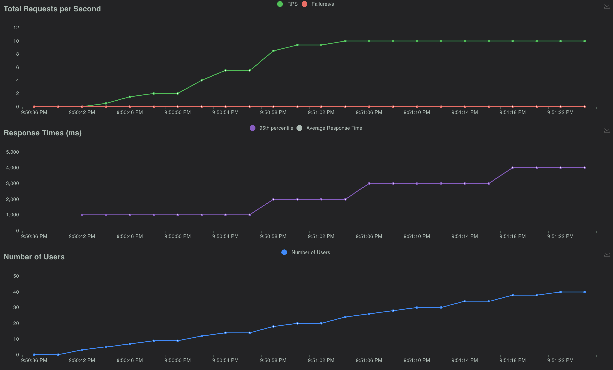

.. _quickstart:

===============
Your first test
===============

A Locust test is just a Python program making requests to the system you're testing. This makes it very flexible and particularly good at implementing complex user flows. But it can do simple tests as well, so let's start with one of those:

.. code-block:: python

    from locust import HttpUser, task

    class HelloWorldUser(HttpUser):
        @task
        def hello_world(self):
            self.client.get("/hello")
            self.client.get("/world")

This instance of :ref:`HttpUser` makes an HTTP request to ``/hello``, then to ``/world``.

.. note:: Locust

   Locust is a load testing tool, when you run it you specify the number of concurrent users you want to simulate, and Locust creates an instance per user. Each user runs a task, sleeps, then runs another task, and so on.

To run your first locust test

#. Prepare a service to test, either a real service you own, or a demo service to test:

    - if you have access to a service you can run tests against, change the ``/hello`` and ``/world`` in the previous code block to two endpoints on your service
    - if you don't, create two empty files in the current directory, ``hello`` and ``world``, and run ``python3 -m http.server 9000`` in that directory to run a simple server on port 9000.

#. Start the Locust web interface, by pasting the edited codeblock into a file named ``locustfile.py`` in your current directory and then running ``locust``:

    .. code-block:: console
        :substitutions:

        $ locust
        [2021-07-24 09:58:46,215] .../INFO/locust.main: Starting web interface at http://0.0.0.0:8089
        [2021-07-24 09:58:46,285] .../INFO/locust.main: Starting Locust |version|

#. Open Locust's web interface, available by default on http://localhost:8089 , and specify that you want to run a load test with ``50`` users, with a ramp up time of ``5`` seconds, and either your host address, or ``localhost:9000`` if you're running the Python http.server.

    .. image:: images/webui-splash-screenshot.png
        :alt: Screenshot of the starting page of the Locust web interface

Now Locust is running tests for you!

.. TODO lets update the numbers/screenshots so they match

Running this test with 50 concurrent users, with a ramp up rate of 1 user per second will look something like this:

.. image:: images/webui-running-statistics.png
    :alt: Screenshot of the Locust web interface statistics page

| Under the *Charts* tab you'll find things like requests per second (RPS), response times and number of running users:

.. TODO can we at least point folks to external references on interpreting these graphs?

.. note::

    Interpreting performance test results is quite complex (and mostly out of scope for this manual), but if your graphs start looking like this, the target service/system cannot handle the load and you have found a bottleneck.

    When we get to around 20 users, response times start increasing so fast that even though Locust is still spawning more users, the number of requests per second is no longer increasing. The target service is "overloaded" or "saturated".

    If your response times are *not* increasing then add even more users until you find the service's breaking point, or celebrate that your service is already performant enough for your expected load.

    If you're having trouble generating enough load to saturate your system, take a look at :ref:`increaserr`.

.. _headless:

Next steps
==========

- Learn about running Locust without the web interface, in :ref:`headless mode <running-without-web-ui>`

- See the full list of :ref:`command options <configuration>` by running ``locust --help``.

- Explore a more realistic example with a a more in-depth explanation in :ref:`writing-a-locustfile`.
