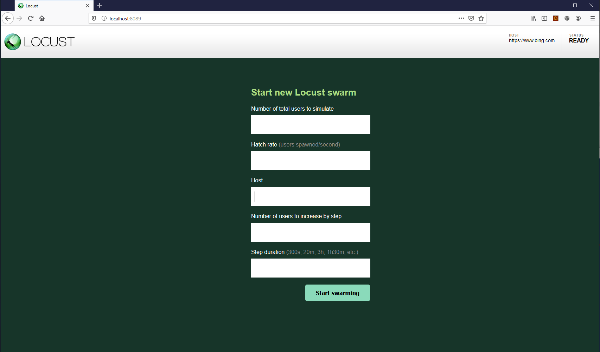

=============
Quick start
=============

Example locustfile.py
=====================

Below is a quick little example of a simple **locustfile.py**:

.. code-block:: python

    from locust import HttpLocust, TaskSet, between

    def login(l):
        l.client.post("/login", {"username":"ellen_key", "password":"education"})

    def logout(l):
        l.client.post("/logout", {"username":"ellen_key", "password":"education"})

    def index(l):
        l.client.get("/")

    def profile(l):
        l.client.get("/profile")

    class UserBehavior(TaskSet):
        tasks = {index: 2, profile: 1}

        def on_start(self):
            login(self)

        def on_stop(self):
            logout(self)

    class WebsiteUser(HttpLocust):
        task_set = UserBehavior
        wait_time = between(5.0, 9.0)

Here we define a number of Locust tasks, which are normal Python callables that take one argument 
(a :py:class:`Locust <locust.core.Locust>` class instance). These tasks are gathered under a
:py:class:`TaskSet <locust.core.TaskSet>` class in the *tasks* attribute. Then we have a
:py:class:`HttpLocust <locust.core.HttpLocust>` class which represents a user, where we define how
long a simulated user should wait between executing tasks, as well as what
:py:class:`TaskSet <locust.core.TaskSet>` class should define the user's \"behaviour\". 
:py:class:`TaskSet <locust.core.TaskSet>` classes can be nested.

The :py:class:`HttpLocust <locust.core.HttpLocust>` class inherits from the
:py:class:`Locust <locust.core.Locust>` class, and it adds a client attribute which is an instance of
:py:class:`HttpSession <locust.clients.HttpSession>` that can be used to make HTTP requests.

By default, we stop looking for proxy settings to improve performance. If you really want the test requests
go through a HTTP proxy, you can inherit from the :py:class:`HttpLocust <locust.core.HttpLocust>` class and
set the trust_env field to True. For further details, refer to the documentation of requests.

Another way we could declare tasks, which is usually more convenient, is to use the
``@task`` decorator. The following code is equivalent to the above:

.. code-block:: python

    from locust import HttpLocust, TaskSet, task, between

    class UserBehaviour(TaskSet):
        def on_start(self):
            """ on_start is called when a Locust start before any task is scheduled """
            self.login()

        def on_stop(self):
            """ on_stop is called when the TaskSet is stopping """
            self.logout()
        
        def login(self):
            self.client.post("/login", {"username":"ellen_key", "password":"education"})
        
        def logout(self):
            self.client.post("/logout", {"username":"ellen_key", "password":"education"})
        
        @task(2)
        def index(self):
            self.client.get("/")
        
        @task(1)
        def profile(self):
            self.client.get("/profile")
    
    class WebsiteUser(HttpLocust):
        task_set = UserBehaviour
        wait_time = between(5, 9)

The :py:class:`Locust <locust.core.Locust>` class (as well as :py:class:`HttpLocust <locust.core.HttpLocust>`
since it's a subclass) also allows one to specify the wait time between the execution of tasks 
(:code:`wait_time = between(5, 9)`) as well as other user behaviours.
With the between function the time is randomly chosen uniformly between the specified min and max values, 
but any user-defined time distributions can be used by setting *wait_time* to any arbitrary function. 
For example, for an exponentially distributed wait time with average of 1 second:

.. code-block:: python

    import random
    
    class WebsiteUser(HttpLocust):
        task_set = UserBehaviour
        wait_time = lambda self: random.expovariate(1)*1000

Start Locust
============

To run Locust with the above Locust file, if it was named *locustfile.py* and located in the current working
directory, we could run:

.. code-block:: console

    $ locust

If the Locust file is located under a subdirectory and/or named different than *locustfile.py*, specify
it using ``-f``:

.. code-block:: console

    $ locust -f locust_files/my_locust_file.py

To run Locust distributed across multiple processes we would start a master process by specifying
``--master``:

.. code-block:: console

    $ locust -f locust_files/my_locust_file.py --master

and then we would start an arbitrary number of slave processes:

.. code-block:: console

    $ locust -f locust_files/my_locust_file.py --slave

If we want to run Locust distributed on multiple machines we would also have to specify the master host when
starting the slaves (this is not needed when running Locust distributed on a single machine, since the master
host defaults to 127.0.0.1):

.. code-block:: console

    $ locust -f locust_files/my_locust_file.py --slave --master-host=192.168.0.100

Parameters can also be set in a `config file <https://github.com/bw2/ConfigArgParse#config-file-syntax>`_ (locust.conf or ~/.locust.conf) or in env vars, prefixed by LOCUST\_

For example: (this will do the same thing as the previous command)

.. code-block::

    # locust.conf in current directory
    locustfile locust_files/my_locust_file.py
    slave

.. code-block:: console

    $ LOCUST_MASTER_HOST=192.168.0.100 locust

.. note::

    To see all available options type: ``locust --help``

Open up Locust's web interface
==============================

Once you've started Locust using one of the above command lines, you should open up a browser
and point it to http://127.0.0.1:8089 (if you are running Locust locally). Then you should be
greeted with something like this:

.. image:: images/webui-splash-screenshot.png

If you :ref:`run Locust in Step Load Mode <running-locust-in-step-load-mode>`, then you should be greeted with Locust UI like this:

