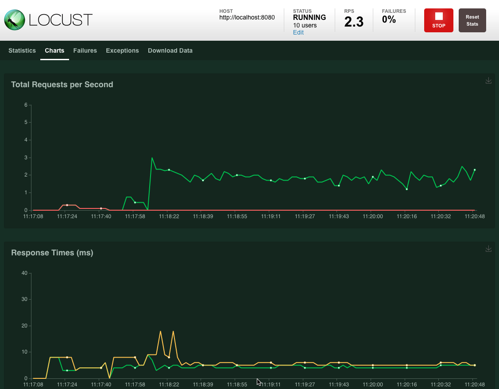

=============
Quick start
=============

In Locust you define your user behaviour in Python code. You then use the ``locust`` command and (optionally) its web interface to spawn and simulate a number of those users while gathering request statistics.

Example locustfile.py
=====================
.. code-block:: python

    import random
    from locust import HttpUser, task, between

    class QuickstartUser(HttpUser):
        wait_time = between(5, 9)

        @task
        def hello(self):
            self.client.get("/hello")
            self.client.get("/world")
        
        @task(3)
        def view_item(self):
            item_id = random.randint(1, 10000)
            self.client.get(f"/item?id={item_id}", name="/item")
        
        def on_start(self):
            self.client.post("/login", {"username":"foo", "password":"bar"})

.. rubric:: Let's break it down

.. code-block:: python

    import random
    from locust import HttpUser, task, between

A locust file is just a normal Python module, it can import code from other files or packages.

.. code-block:: python

    class QuickstartUser(HttpUser):

Here we define a class for the users that we will be simulating. It inherits from 
:py:class:`HttpUser <locust.HttpUser>` which gives each user a ``client`` attribute,
which is an instance of :py:class:`HttpSession <locust.clients.HttpSession>`, that 
can be used to make HTTP requests to the target system that we want to load test. When a test starts, 
locust will create an instance of this class for every user that it simulates, and each of these 
users will start running within their own green gevent thread.

.. code-block:: python

    wait_time = between(5, 9)

Our class defines a ``wait_time`` function that will make the simulated users wait between 5 and 9 seconds after each task 
is executed. For more info see :ref:`wait-time`.

.. code-block:: python

    @task
    def hello(self):
        self.client.get("/hello")
        self.client.get("/world")
    
    @task(3)
    def view_item(self):
        item_id = random.randint(1, 10000)
        self.client.get(f"/item?id={item_id}", name="/item")
        ...

We've also declared two tasks by decorating two methods with ``@task``, one of which has been given a higher weight (3). When a User of this type runs it'll pick one of either ``hello`` 
or ``view_item`` - with three times the chance of picking ``view_item`` - call that method and then pick a duration 
uniformly between 5 and 9 and just sleep for that duration. After it's wait time it'll pick a new task 
and keep repeating that.

In the ``view_item`` task we load a dynamic URL by using a query parameter that is a number picked at random between 
1 and 10000. In order to not get 10k separate entries in Locust's statistics - since the stats is grouped on the URL - we use 
the :ref:`name parameter <name-parameter>` to group all those requests under an entry named ``"/item"`` instead.

Note that only methods decorated with ``@task`` will be called, so you can define your own internal helper methods any way you like.

.. code-block:: python

    def on_start(self):

Additionally we've declared a `on_start` method. A method with this name will be called for each simulated 
user when they start. For more info see :ref:`on-start-on-stop`.

Start Locust
============

Put the above code in a file named *locustfile.py* in your current directory and run:

.. code-block:: console

    $ locust

If your Locust file is located somewhere else, you can specify it using ``-f``

.. code-block:: console

    $ locust -f locust_files/my_locust_file.py

Locust's web interface
==============================

Once you've started Locust using one of the above command lines, you should open up a browser
and point it to http://127.0.0.1:8089. Then you should be greeted with something like this:

.. image:: images/webui-splash-screenshot.png

Fill out the form and try it out! (but note that if you dont change your locust file to match your target system you'll mostly get error responses)

.. image:: images/webui-running-statistics.png

More options
============

To start tests directly, without using the web interface, use ``--headless``

To run Locust distributed across multiple Python processes or even multiple machines see :ref:`running-locust-distributed`

Parameters can also be set through :ref:`environment variables <environment-variables>`, or in a
:ref:`config file <configuration-file>`.

.. note::

    To see all available options type: ``locust --help`` or check :ref:`configuration`
