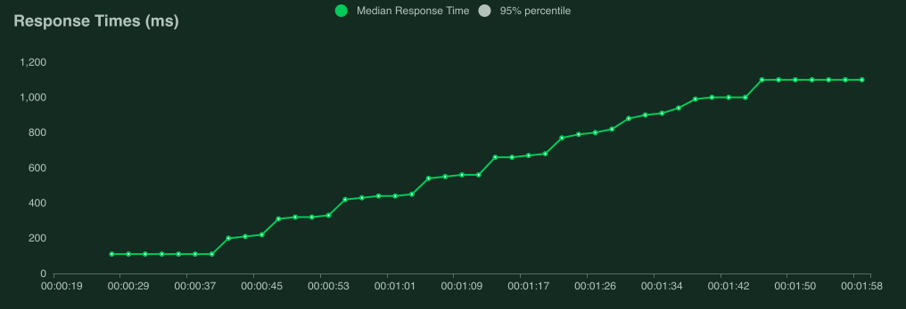
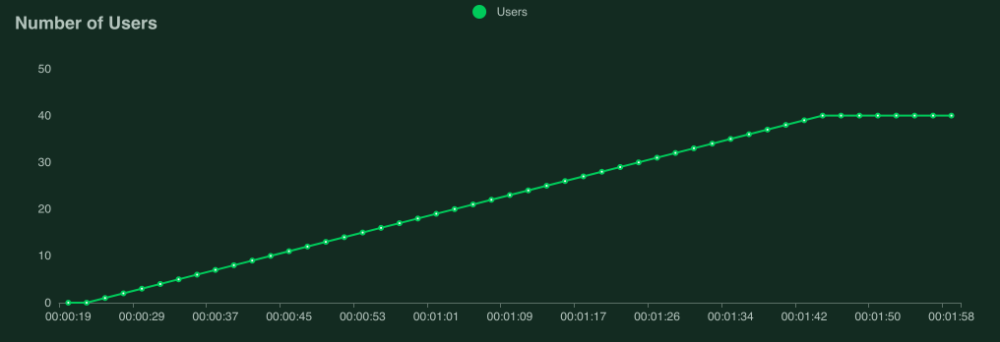

.. _quickstart:

===============
Your first test
===============

A Locust test is essentially just a Python program making requests to the system you want to test. This makes it very flexible and particularly good at implementing complex user flows. But it can do simple tests as well, so let's start with that:

.. code-block:: python

    from locust import HttpUser, task

    class HelloWorldUser(HttpUser):
        @task
        def hello_world(self):
            self.client.get("/hello")
            self.client.get("/world")

This user will make an HTTP request to ``/hello``, then to ``/world``, and then repeat. For a full explanation and a more realistic example see :ref:`writing-a-locustfile`.

Change ``/hello`` and ``/world`` to some actual paths on the website/service you want to test, put the code in a file named ``locustfile.py`` in your current directory and then run ``locust``:

.. code-block:: console
    :substitutions:

    $ locust
    [2021-07-24 09:58:46,215] .../INFO/locust.main: Starting web interface at http://0.0.0.0:8089
    [2021-07-24 09:58:46,285] .../INFO/locust.main: Starting Locust |version|

Locust's web interface
======================

Open http://localhost:8089

.. image:: images/webui-splash-screenshot.png

| Provide the host name of your server and try it out!

The following screenshots show what it might look like when running this test using 50 concurrent users, with a ramp up rate of 1 user/s

.. image:: images/webui-running-statistics.png

| Under the *Charts* tab you'll find things like requests per second (RPS), response times and number of running users:

.. image:: images/total_requests_per_second.png





.. note::

    Interpreting performance test results is quite complex (and mostly out of scope for this manual), but if your graphs start looking like this, the target service/system cannot handle the load and you have found a bottleneck.

    When we get to around 9 users, response times start increasing so fast that even though Locust is still spawning more users, the number of requests per second is no longer increasing. The target service is "overloaded" or "saturated".

    If your response times are *not* increasing then add even more users until you find the service's breaking point, or celebrate that your service is already performant enough for your expected load.

    If you need some help digging into server side problems, or you're having trouble generating enough load to saturate your system, take a look at the `Locust FAQ  <https://github.com/locustio/locust/wiki/FAQ#increase-my-request-raterps>`_.

Direct command line usage / headless
====================================

Using the Locust web UI is entirely optional. You can supply the load parameters on the command line and get reports on the results in text form:

.. code-block:: console
    :substitutions:

    $ locust --headless --users 10 --spawn-rate 1 -H http://your-server.com
    [2021-07-24 10:41:10,947] .../INFO/locust.main: No run time limit set, use CTRL+C to interrupt.
    [2021-07-24 10:41:10,947] .../INFO/locust.main: Starting Locust |version|
    [2021-07-24 10:41:10,949] .../INFO/locust.runners: Ramping to 10 users using a 1.00 spawn rate
    Name              # reqs      # fails  |     Avg     Min     Max  Median  |   req/s failures/s
    ----------------------------------------------------------------------------------------------
    GET /hello             1     0(0.00%)  |     115     115     115     115  |    0.00    0.00
    GET /world             1     0(0.00%)  |     119     119     119     119  |    0.00    0.00
    ----------------------------------------------------------------------------------------------
    Aggregated             2     0(0.00%)  |     117     115     119     117  |    0.00    0.00
    (...)
    [2021-07-24 10:44:42,484] .../INFO/locust.runners: All users spawned: {"HelloWorldUser": 10} (10 total users)
    (...)

See :ref:`running-without-web-ui` for more details.

More options
============

To run Locust distributed across multiple Python processes or machines, you start a single Locust master process
with the ``--master`` command line parameter, and then any number of Locust worker processes using the ``--worker``
command line parameter. See :ref:`running-distributed` for more info.

To see all available options type: ```locust --help`` or check :ref:`configuration`.

Next steps
==========

Now, let's have a more in-depth look at locustfiles and what they can do: :ref:`writing-a-locustfile`.
