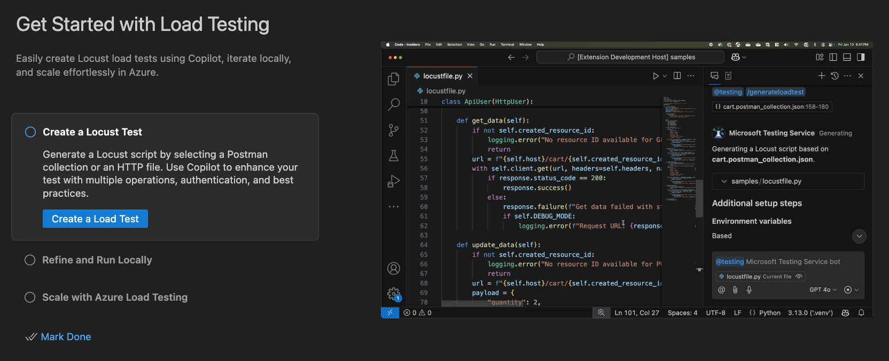

.. _vscode-extension:

VS Code Extension
=================

Microsoft maintains an excellent `VS Code extension <https://marketplace.visualstudio.com/items?itemName=ms-azure-load-testing.microsoft-testing>`_ based on Copilot that helps you create and run Locust tests. 

Among other things, it can:

* Create locustfiles from .http files, Postman collections or Insomnia collections
* Run tests locally or scale up using `Azure Load Testing <https://learn.microsoft.com/sv-se/azure/app-testing/load-testing/overview-what-is-azure-load-testing>`_
* Fetch insights and help implement performance suggestions based on test results

